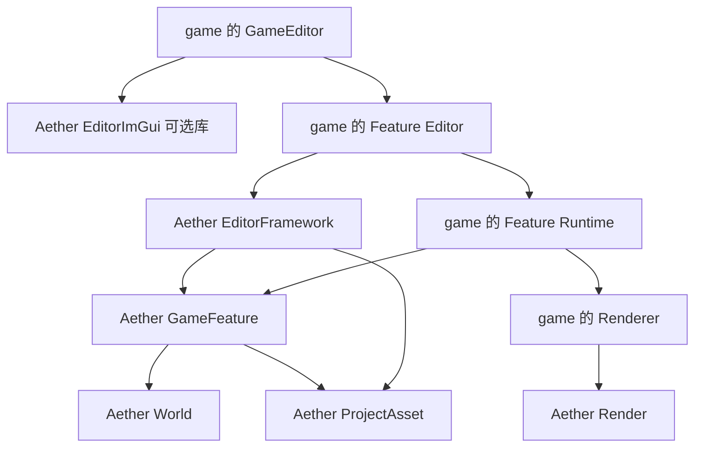
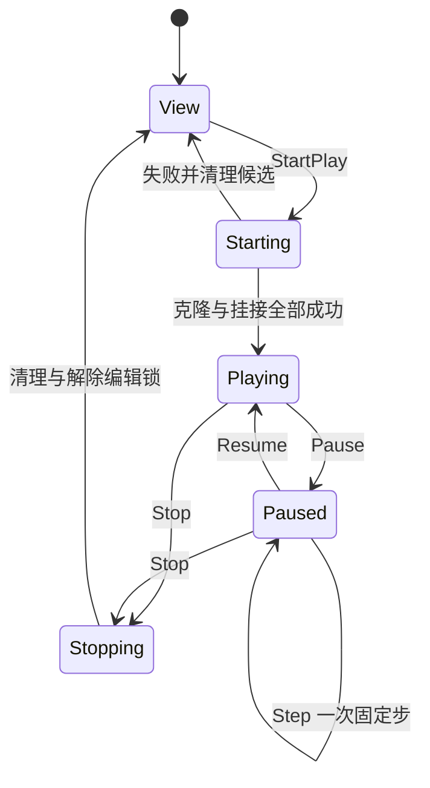

# EditorFramework 设计规范

状态：待实施的 v1 设计，不代表文中新增 API 已存在。本文与 [实施任务书](EditorFrameworkImplementation.md) 共同构成实施依据；本文约束语义，任务书约束顺序、文件归属和验收。发生冲突时先修正文档，不由实施者自行选择另一套架构。

调研基线：2026-09-25，Aether `6dcb3af`，Noka `ee1858b`。文档放在 Aether 现有文档目录 `Engine/Documents`。本次交付仅包含设计与实施方案。

## 1. 目标与确定的边界

EditorFramework 是供 game 组装编辑器的 ECS 框架。Aether 发布库、协议、通用编辑系统和可选 UI 适配库；game 在自己的 CMake 工程中编译 `GameEditor` 可执行程序，选择 GameFeature、窗口、布局和渲染实现。

本设计将需求中的资源编辑理解为：**具体资源格式、导入器、资源编辑行为及预览全部由 GameFeature 提供；框架提供资源文档、类型路由、事务、历史和 UI 宿主。** Aether 不内置 Voxel、NokaWorld、glTF 或某种游戏材质的编辑器。

必须成立的约束：

1. 编辑器业务状态存在于 ECS 组件，行为由 System 执行。文档、窗口内面板、选择集、工具状态、Play 会话、导入任务和命令均有实体或组件表示。
2. World 的 `View` 是可编辑、不运行游戏模拟的视图；`Play` 在独立运行 World 中模拟。资源编辑是独立文档，不是 World 面板上的特殊分支。
3. GameFeature 是一个独立 CMake 工程/子工程，具有 Runtime 和可选 Editor targets。其 Runtime 可以提供 RenderSystem，Editor 可以提供 BrushSystem；启用 Editor 不应复制一份游戏 Runtime。
4. EditorFramework 不创建场景 GPU 资源，不实现渲染算法，不假设相机、光照、坐标系或拾取算法。画面和空间工具能力来自 game 注册的 GameFeature。
5. component 的持久化资源字段只保存项目资源引用，不能保存外部路径、裸加载器对象或 GPU 句柄。只有完成 import 并提交到项目目录和目录索引的资源才可被选择和使用。
6. 资源类型、组件类型、字段和编辑器以稳定字符串标识。Inspector 即使面对空资源引用，也知道字段要求的资源类型。
7. 生产引擎代码不得出现 Noka include、链接依赖、类型名分支或“World 必须有且只有一个 voxel component”的规则。

### 1.1 v1 范围

v1 必须打通：创建/打开项目，显式注册 Feature，导入资源，创建/打开 World 文档，增删实体与已注册组件，字段编辑，按类型选择资源并打开资源编辑文档，Undo/Redo，保存与重开，View/Play/停止，Pause/单步，多个视口与资源文档共存。

v1 固定以下简化，不交给实施者猜测：

- 同进程一次打开一个项目；多个 World/资源文档；一次只有一个 Play 会话。
- View 和 Play 可同时显示。Play 期间项目的所有持久化编辑、导入提交、资源保存均被锁定，资源面板只读。停止后继续编辑。
- Play 从当前内存中的 World 创建，不要求先保存 World；如存在未保存的资源文档，Play 返回 `UnsavedAssetDocument`，由界面提供保存或取消，不悄悄忽略资源草稿。
- Play 不向编辑 World 或项目资源回写。应用 Play 变更、协作编辑、脚本热重载、Feature 动态库热卸载、资源依赖循环、跨 World 实体引用不在 v1。
- UI 第一适配选择当前 ImGui，限单个原生 OS 窗口内的多个 dock 面板；不承诺 ImGui 平台多窗口支持。
- 无 UI、无渲染 provider 时，框架仍可执行全部数据操作和自动化测试；无画面时视口显示“未注册预览能力”。这里“无渲染”指不初始化 GPU，现有 World 的传递链接依赖仍可能包含 Render/Window。

## 2. 当前代码与需要补齐的能力

以下是实际实现，不是新增设计 API：

| 现有代码 | 可复用能力 | 设计必须处理的缺口 |
| --- | --- | --- |
| [World.h](../Runtime/World/src/World/World.h)、[World.cpp](../Runtime/World/src/World/World.cpp) | EnTT 实体/组件，System 挂接，按 signature 拓扑排序 | 未公开 registry context；无 phase/mode 调度；析构当前不会逐项调用 `OnDetach` |
| [System.h](../Runtime/World/src/World/System.h) | update/event/render extraction 回调 | `OnUpdate` 对全部 System 调用；把 dt 改成 0 不能可靠暂停模拟 |
| [ComponentCodecRegistry.h](../Runtime/World/src/World/Serialization/ComponentCodecRegistry.h) | 字符串类型、版本、transient codec、冻结注册表 | 没有 Inspector 字段 schema，没有项目资源引用遍历能力 |
| [WorldArchive.cpp](../Runtime/World/src/World/Serialization/WorldArchive.cpp) | detached World 序列化与重建、实体引用重映射 | 序列化不能处于 System 回调内；序列化时临时分配的 `e000001` 不是持久实体 ID |
| [WorldArchive.h](../Runtime/World/src/World/Serialization/WorldArchive.h) | WorldDirectory 文件归档 | `SaveWorldDirectory` 是目标不得存在的 Save As，不能直接实现 Ctrl+S；其 `AssetRef` 是包内 path/kind |
| [AssetInfo.h](../Runtime/Resource/src/Resource/AssetInfo.h)、[Finder.h](../Runtime/Resource/src/Resource/Finder.h) | 旧 Image/Shader 枚举及资源 bundle 查找 | 不是开放类型项目资源库；不能扩充 switch 来实现 GameFeature |
| [Layer.h](../Runtime/Window/src/Window/Layer.h) | render command/frame 提取与拥有式快照 | 适合薄宿主接线，不应存放编辑器业务状态 |
| [RenderFeature.h](../Runtime/Render/src/Public/Render/Feature/RenderFeature.h) | RenderThread 的 Feature 与拥有式 frame data | `Render::RenderFeature` 不等于本文的 GameFeature；当前输出上下文按窗口目标组织 |
| [ImGui 后端说明](../Runtime/ImGui/RenderGraphBackend.md) | SDL 前端、异步 packet、GPU 生命周期 | 旧用户纹理注册是同步兼容路径；异步视口需要新的句柄桥接，不能在主线程创建 Vk 纹理补洞 |

Noka 当前有 `NokaWorld`、`VoxelWorldRenderSystem`、`StaticMeshRenderSystem` 和 `WorldRenderFeature`，足以验证抽象的需求。其 `StaticMeshRendererComponent::gltfPath`、`SkyboxComponent::exrPath`、`VoxelWorldComponent::world` 需要由 **Noka 自己**迁移为资源引用与 transient runtime 状态；这些类型不得搬进引擎。Noka 路径仅用于调研，验收工程不能依赖它存在。

## 3. 模块与依赖

新增模块采用现有 C++23 与逐模块安装包惯例：

| 源码目录 / 安装 target | 职责 | 直接依赖 |
| --- | --- | --- |
| `Engine/Runtime/ProjectAsset` / `Aether::ProjectAsset` | ID、引用、目录格式、类型描述、只读解析、验证、依赖枚举契约 | Core、Filesystem；无 Editor、World 依赖 |
| `Engine/Runtime/GameFeature` / `Aether::GameFeature` | Feature 清单与依赖、Runtime 注册、World 的角色与系统装配 | World、ProjectAsset |
| `Engine/Editor/EditorFramework` / `Aether::EditorFramework` | EditorWorld、命令、历史、项目写入、导入、文档、Inspector 数据模型、Play、视口协议 | GameFeature、ProjectAsset、World、Filesystem |
| `Engine/Editor/EditorImGui` / `Aether::EditorImGui` | 通用 dock/panel/字段控件、UI 意图采集、薄 Layer 适配 | EditorFramework、现有 ImGui/Window |
| game 的 `<Feature>Runtime` | 组件 codec、资源类型与 runtime loader、游戏/渲染 systems | GameFeature 及 game 自己的依赖 |
| game 的 `<Feature>Editor` | importer、editor schema、资源编辑 systems、空间工具与可选 UI | `<Feature>Runtime`、EditorFramework；使用 ImGui 时再依赖 EditorImGui |
| game 的 `GameEditor` | 入口、Feature 组合、布局与 renderer/UI 桥选择 | Entry、EditorFramework、选定 UI 与 Feature Editor targets |

依赖箭头表示“依赖”：



`EditorFramework` 公共头文件不暴露 `Vk*`、RHI texture、`ImTextureID`、Noka 类型或某套投影矩阵。现有 World 传递依赖 Render/Window 是现状，v1 不捎带做全引擎去耦。未来拆除这些传递依赖不会改变 EditorFramework 的场景协议。

引擎提供通用 UI **库**不等于提供完整 editor：Aether 不生成可交付 `AetherEditor`，不自动加载某个 game、不提供默认场景渲染器。game 可以直接消费 EditorWorld 的数据模型，完全替换 EditorImGui。

## 4. 完整 ECS 的具体含义

### 4.1 状态与对象边界

复用 `Aether::World`；不新增第二套实体系统，也不为 panel/asset editor 建立 `IEditorWindow::Update()` 对象树。

| 所属 ECS | 实体 / 组件 | 内容 |
| --- | --- | --- |
| EditorWorld | 会话实体 `EditorSessionComponent`、`ProjectStateComponent` | project ID、打开状态、全局编辑锁、项目 catalog 快照与 generation |
| EditorWorld | 注册表实体 `FeatureRegistryComponent` 等 | 不可变描述表、schema、codec 表、factory；激活状态另放组件 |
| EditorWorld | Feature 实体 `ActiveFeatureComponent` | FeatureId、装配状态、已分配的 scope token |
| EditorWorld | 文档实体 `DocumentComponent`、`HistoryComponent` | DocumentId、类型、dirty/saved 游标、错误、命令历史 |
| EditorWorld | World 文档实体 `WorldDocumentComponent` | 拥有 `unique_ptr<World>` 的 AuthoringWorld，WorldInstanceId、修订号 |
| EditorWorld | 资源文档实体 `AssetDocumentComponent` | AssetId、类型、基础 revision、Feature 定义的草稿组件 |
| EditorWorld | Play 实体 `PlaySessionComponent` | 状态机、独立 PlayWorld、资源版本快照、暂停时钟 |
| EditorWorld | 视口/面板实体 `ViewportComponent`、`PanelComponent` | 目标 World/文档、ViewId、大小、焦点、provider、输出 token |
| EditorWorld | `SelectionComponent`、工具组件 | 带 World 标识的选择、工具参数、拖动中的事务 ID |
| EditorWorld | 请求/任务实体 | import、open、save、play、pick、command 的 payload/status/error |
| AuthoringWorld | game 组件与基础编辑身份组件 | 可序列化的场景数据；runtime 缓存为 transient |
| PlayWorld | 从编辑数据重建的 game 组件 | 游戏模拟状态；独立的可变资源实例 |
| PreviewWorld，可选 | Feature 建立的预览实体 | 仅资源预览；无 gameplay simulation、无保存入口 |

进程级常量表、纯算法、函数指针、文件句柄/线程/GPU 边界的 RAII 适配器可以是普通 C++ 对象。它们不能另存一份当前选择、活动文档、dirty 状态或 Play 状态。System 允许沿用现有虚接口，只持有所属 World/context 的非拥有访问与不变配置；Feature 的加载进度、工具状态、缓存修订号等可观察状态放组件。

`EditorHost` 只拥有 EditorWorld 并按固定顺序调用 system/安全点、转发平台事件、接线渲染提取。它没有 `m_SelectedEntity`、`m_OpenDocuments`、`m_Playing` 这些第二份真相。

### 4.2 标识与生命周期

- `ProjectId`、`AssetId`、`DocumentId`、`PersistentEntityId` 使用不同强类型封装的 UUID；可复用 Core 的 UUID 创建与解析并补充 equality/hash。不能将不同 ID 都 typedef 成裸 string。
- `WorldInstanceId` 每次创建或替换 World 都新建；`ViewId` 每个视口唯一；异步操作还带 `generation`。
- 编辑目标为 `{WorldInstanceId, PersistentEntityId}`。先按 World 找实体映射，再检查 `IsValid`；不能跨 World 传递裸 `entt::entity`。
- `PersistentEntityIdComponent` 是注册在 GameFeature 基础设施中的 Runtime codec，保存 UUID；新建/复制实体分配新 UUID。加载发现重复 UUID 则失败。原归档 `e000001` 继续用于该份文件内实体引用，不替代持久 UUID。
- 基础可编辑实体包含 `EntityNameComponent`，可选 `ParentComponent{PersistentEntityId}`；Parent 同 World、无环，删除含子节点的实体在 v1 采用显式 DeleteSubtree 命令。不强制 game 使用某种 Transform。
- Runtime component 描述同时登记 entity-reference visitor（没有引用也显式声明），用来校验同 World 引用与删除的影响。DeleteSubtree 若仍被子树外的组件引用，先拒绝删除，用户通过独立编辑操作清理引用后重试；不默默把 required 引用置空。
- 文档关闭、Stop、项目关闭只能在安全点发生。先取消请求/提升 generation，取消 CPU jobs 并收取结果，逆序卸载 systems，解除视口/渲染连接，再销毁 World。RenderThread 持有的快照/资源等 fence 完成后释放。

AuthoringWorld/PlayWorld 内专供服务、相机预览或 runtime 的实体显式带新增 `Serialization::ExcludeFromArchiveComponent`。序列化整实体跳过该标记目标，不能只依靠各 component 的 transient 标志，否则现有 serializer 仍会写出空实体。普通 authored entity 必须有持久 ID；不能因“没有可存组件”就隐式丢掉它。其他持久组件若引用被排除的实体，序列化/引用验证失败。基础注册函数登记该 marker 为 transient，clone/load 后由 mount 重新建立服务实体。

这些身份约束也避免依赖 EnTT entity 内部位布局；EnTT 官方将 entity 视作 opaque 标识，registry 负责有效性检查。[EnTT ECS 文档](https://github.com/skypjack/entt/wiki/Entity-Component-System)

### 4.3 调度与安全点

新增 `SystemUpdatePhase`：`EditorInput`、`EditorTools`、`Simulation`、`Presentation`、`EditorModel`。现有 System 默认 `Simulation`。新增 `System::GetUpdatePhase()` 与 `World::OnUpdatePhase(phase, dt)`；旧 `World::OnUpdate(dt)` 的“按原依赖顺序更新全部 System 一次”语义保留。一个 Host tick 不得混用两种更新入口。

`BuildExecutionOrder` 仍校验重复、缺依赖和环。phase 模式额外拒绝依赖更晚 phase 的 system；同 phase 用原拓扑次序。同一 World 内依赖必须真实存在，不能因某 mode 不安装某 system 而忽略缺失依赖。跨 World 的先后由 Host 阶段定义，不借用 signature 建立跨 World 指针依赖。

| 阶段 | 操作 | 可否修改持久数据 |
| --- | --- | --- |
| A 主线程安全点 | 收取拥有式任务结果；应用上帧意图；处理 create/open/save/start/stop；装卸 systems | 验证后的事务可以 |
| B EditorWorld | EditorInput 路由已采集事件；EditorTools 产生命令 | 只产生意图 |
| C 主线程安全点 | 校验并提交本帧工具命令，刷新 dirty/revision | 可以 |
| D Worlds | Play 的 Simulation 固定步；各 World 的 Presentation；View 不执行 Simulation | Simulation 只写 Play；Presentation 只写 transient |
| E EditorWorld | EditorModel 构造 Inspector/浏览器/状态/视口请求的数据 | 不修改持久数据 |
| F UI 适配 | 在 `OnImGuiUpdate` 绘制并收集意图/布局 | 意图排到下一帧 A |
| G 提取 | `ExtractRenderCommands`、`ExtractRenderData`；只构造拥有式 payload | 不再提交编辑 |

当前 Window 的 `OnUpdate` 在 `OnImGuiUpdate` 前，随后提取 frame，因此 v1 明确允许 UI 操作有一帧延迟；不要在 ImGui 回调内立即运行保存或模拟来追求零延迟。绘制可使用本帧矩形，渲染请求使用已提交矩形；resize 期间显示上一完成图像。

安全点系统是由固定 pipeline 调用的普通 ECS 函数，例如 `ApplyEditCommands(EditorWorld&)`、`AdvanceDocumentLifecycle(EditorWorld&)`。它们仍从组件取状态，但执行时所有 `World::Dispatch` 都已返回。这满足现有序列化不能处于 System callback 内的约束。需要增删 ECS 结构的循环先收集 EntityId，结束遍历后再批量提交。

## 5. GameFeature 协议

### 5.1 包、注册和激活

一个 Feature 工程至少导出 `<Feature>Runtime`，可同时导出 `<Feature>Editor`。注册采用显式函数调用，不使用静态构造函数自注册，避免静态库链接裁剪与不确定初始化顺序。

```cpp
// 新增协议的接口草图，辅助类型按本文与任务书实现。
struct FeatureDescriptor {
    FeatureId id;                   // 如 "example.voxel-world"
    uint32_t version;              // v1 使用精确版本匹配
    uint32_t apiVersion;           // 框架注册协议版本，初始 1
    std::vector<FeatureRequirement> dependencies;
};
Result<void> RegisterVoxelRuntime(RuntimeFeatureRegistrar&);
Result<void> RegisterVoxelEditor(EditorFeatureRegistrar&);
```

Runtime 注册：component codecs、运行所需的资源类型/loader/依赖枚举器、World system factories、可选 Runtime 命令。Editor 注册：importers、组件 schema/编辑操作、resource editor descriptors、tool systems、viewport provider，以及可选 UI systems。Editor registrar 引用同一个 FeatureId，不能重复注册 Runtime 资源类型。

项目 manifest 指定所需 FeatureId/version。game 入口先建立“已编译可用”集合，再按 manifest 解析依赖、拓扑排序、校验能力和所有重名，构造候选注册表，最后原子发布并 Freeze。缺 Feature、版本不符、重复类型 ID、缺依赖、环、Editor 对应 Runtime 不存在均返回明确错误；失败不留下半张表。

v1 注册表在会话内不可变，不能依靠 registry 解冻来切换 Feature。项目切换先关闭整个会话。静态链接无“扫描 DLL 自动发现”。API version 不提供跨编译器 ABI 稳定承诺。

### 5.2 System 装配与角色

`WorldRole` 为 `Authoring`、`Play`、`AssetPreview`；EditorWorld 自身是编辑器调度域，不混入游戏实体。`SystemRegistration` 包含稳定 signature、dependency signatures、phase、适用角色和 factory；实际 System 的 signature/dependencies 与登记信息要校验一致。先验证所选 role 的登记图，再按拓扑顺序逐项创建/挂接。

| 例子 | 所属 target | 所属 ECS / 角色 | 调用 |
| --- | --- | --- | --- |
| VoxelWorldRenderSystem | VoxelWorldFeatureRuntime | Authoring、Play、可选 Preview | Presentation / 提取 |
| MovementSystem、PhysicsSimulationSystem | FeatureRuntime | Play | Simulation |
| VoxelBrushSystem | VoxelWorldFeatureEditor | EditorWorld | EditorTools，向目标文档产生事务 |
| VoxelAssetEditModelSystem | FeatureEditor | EditorWorld 的资源文档实体 | EditorModel |
| VoxelAssetPanelSystem | FeatureEditor，可选 UI 依赖 | EditorWorld | UI adapter 的绘制阶段 |

**Runtime 不等于 Play-only**。渲染同步/加载反馈即使处于 View 也要运行；模拟系统才仅在 Play 激活。Presentation 不得偷偷推进 physics/gameplay，声明为 View 可用的系统要通过验证。

工厂接收 `WorldMountContext{role, worldInstanceId, catalogSnapshot, serviceBindings}` 并返回 owned System。`FeatureMountScope` 记录成功挂接项，失败逆序 `EraseSystem`；卸载在安全点逆序执行且只执行一次。工厂按依赖拓扑序挂接，OnAttach 仅建立本系统资源，不查询尚未挂接的依赖系统；全部挂接后再发布可运行状态。依赖 world 的 cache/loader 状态放 world transient 服务实体，禁止把同一个可变 system 实例挂进两个 World。

资源 import、asset editor、viewport provider 都是 Feature 的能力登记，不要求每个 Feature 都提供全部能力。一个逻辑 GameFeature 可以用多个依赖 Feature 组合，但有且仅有一个稳定 ID 与对应注册入口。

## 6. 项目资源模型：import 是引用前提

### 6.1 核心类型与不变量

新增类型放在 `Aether::ProjectAssets`，避免与既有 `Aether::Serialization::AssetRef` 同名混用：

```cpp
struct ProjectAssetRef {
    ProjectId project;
    AssetId asset;
};
using AssetTypeId = std::string;   // 规范化、区分大小写，如 "example.voxel-world"
struct AssetRecord {
    AssetId id;
    AssetTypeId type;
    FeatureId ownerFeature;
    uint32_t formatVersion;
    uint64_t revision;
    std::string displayPath;      // 用户逻辑路径，不作为引用身份
    std::string artifactRoot;     // 项目内不可变 revision 目录
    std::string entryPoint;       // 相对 artifactRoot
    std::vector<ProjectAssetRef> dependencies;
    ImportProvenance provenance;  // importer ID/version/settings、源文件清单
};
```

空引用用 `std::optional<ProjectAssetRef>`；不使用空 UUID 混充合法资源。ref 不重复保存可漂移的 type，实际类型以 catalog 为准。字段要求的 type 存在 schema，因此即使值为空或资源缺失也能显示 `Voxel World (example.voxel-world)`。

稳定字符串要求：FeatureId、AssetTypeId、ComponentTypeId 使用小写 namespace 风格 `[a-z0-9][a-z0-9._-]*`，禁止空值与空白；FieldId 在所属 component 内唯一且不能随 UI label 翻译变化。引擎保留 `aether.` 命名空间。v1 资源类型精确匹配，不按扩展名、C++ RTTI 或类型继承猜测兼容。

对每个非空引用，必须同时验证：同 ProjectId；AssetId 在当前已提交 catalog；type 符合字段契约；所属 Feature 可用；revision 与文件完整；依赖闭包合法。引用资源不存在时保留原 ID 用于诊断，不能自动变成空引用或去磁盘按路径搜同名文件。

项目文件不必每次保存 type 到字段值内；Inspector 展示 schema 的 expected type 和 catalog 的 actual type，发生不符即显示错误，编辑器路由只对已验证 actual type 执行。

### 6.2 项目目录和提交模型

```text
MyProject/
  project.aether.json             # 项目 ID、精确 Feature 清单、配置版本
  Assets/
    catalog.json                 # 资源记录的唯一已提交索引
    Data/<asset-id>/<revision>/   # 不可变的 source/settings/artifacts 集合
      Source/                    # 源文件及其完整依赖；可用于重新导入
      Artifacts/                 # runtime/editor 可解析的项目内内容
  Worlds/<document-id>.world.json # 编辑 World 文档；引用 catalog 中 AssetId
  .aether/
    staging/<transaction-id>/    # 未提交的导入/资源保存
    session/                    # 本机 UI 布局等，非游戏数据
```

`project.aether.json` 最小例：

```json
{
  "format": "Aether.Project",
  "version": 1,
  "projectId": "ba17c8cb-ced4-4c4a-8bf7-728588893470",
  "features": [{"id": "example.voxel-world", "version": 1}]
}
```

`catalog.json` 包含独立 format/version、ProjectId、递增 catalogGeneration 和全部 AssetRecord。项目状态组件持有该 catalog 的不可变快照；读侧缓存以 `(ProjectId, AssetId, revision)` 为键。换快照时生成变更事件，不允许修改读者正在使用的记录。

每个 revision 的 Manifest 列出 Source/Artifacts 的相对文件路径与 byteSize，提交前检查文件齐全、大小一致、路径不越界；实际内容格式由 Feature loader/importer 验证。v1 不声称仅靠 byteSize 检测所有内容损坏。旧源位置只作显示用 provenance，不作为运行时 fallback。默认重新导入使用已捕获的 Source；用外部文件替换来源是显式的 import 操作。

世界文件独立于 catalog：保存 World 只更新一个文件；创建新资源后 World 尚未保存时可能存在未引用资源，这是允许状态。v1 不做多文件跨文档原子 Save All，Save All 逐文档保存并逐项显示结果。

资源 `displayPath` 重命名只修改 catalog，不搬数据、不改 AssetId；重导入相同资源保留 AssetId、增加 revision。跨项目复制必须在目标项目重新 import 并产生目标 ProjectId/AssetId 映射。v1 不提供资源物理删除/自动 GC，旧 revision 暂保留，以免破坏打开文档、undo、Play 或在途帧。手工丢文件报 MissingAsset。

### 6.3 导入事务

导入器注册含 `{importerId, featureId, outputType, version, extensions, probe, import}`。扩展名只帮助筛选；多个 importer 命中时提供选择并保存选项，禁止“最后注册覆盖”。文件位于 project/Assets 内也不自动算已导入。

顺序固定：

1. `ImportRequest` 保存外部输入路径、所选 importer、settings；创建任务实体。外部路径只允许出现在这类输入/迁移记录中。
2. worker 读取输入，在 staging 复制自包含 Source 及全部依赖，产出 Artifacts 与 Manifest；不得访问 live World、全局 registry 或 ImGui。按需由 Feature 将外部依赖变成独立资源引用或同一 asset 的内部文件。
3. 单主线程提交系统验证类型登记、输入/输出大小限制、依赖闭包、入口文件、所有相对路径以及 project generation。源路径中的 `..`、symlink 不能让 **已提交的项目引用**逃出项目目录；import 可以读用户选择的外部文件，但只能通过声明的依赖列表捕获它们。
4. 为新资源分配 UUID，或为重导入保留旧 UUID；为 revision 生成唯一目标目录。先把完整 staging revision 发布到 `Assets/Data`，再构造新 catalog 临时文件。
5. 校验临时 catalog 后原子替换 `catalog.json`，替换成功才发布新内存快照、发出 AssetChanged。禁止先修改内存引用后等待文件写入。
6. 失败/取消时旧 catalog 和旧引用仍可使用。revision 已落盘而 catalog 未更新只形成不可见孤立目录，不算成功导入。重新启动只认 catalog，不自动把 staging 或孤立目录纳入项目。

`AtomicReplaceFile` 必须分别实现支持平台的覆盖替换；同目录临时文件、关闭并检查写入结果后提交，不能用“删除旧文件再 rename”。v1 保证普通进程内失败与进程中断下不会读取半个 JSON；不声称已经保证断电后的磁盘持久性。manifest/catalog 都使用大小、深度、计数限制；依赖 DAG 拒绝环，路径规范化与数据完整性错误带资产/路径上下文。

创建新资源走 `CreateAsset` 事务，其 producer 是 Feature 的默认内容工厂；这同样是一种 import，不能为了 Brush 新建一个未登记文件再塞路径到 component。资源编辑保存则创建该资源的新 revision，走同一提交路径。

Feature 的资源保存回调必须产出完整的新 Source/settings/Artifacts，使保存内容成为项目内的权威源并能再次导入；不能只改 Artifact，随后又从旧 Source 覆盖编辑结果。无法完成这个往返的资源类型只注册只读 editor，或只允许修改 importer settings 并重新生成。brush 等原生资源可用同一种 canonical 内容作为 Source 与运行数据。

v1 一次串行提交一个项目写事务；worker 可以并行准备。打开可写项目要取得 OS 进程锁，第二个 editor 只能只读打开或报 ProjectBusy；runtime 只读读取不持写锁。锁的拥有句柄由 ProjectStateComponent 的平台资源适配成员管理，进程退出后 OS 释放，不能只靠 lock 文件是否存在判断。任务结果带 ProjectId、session generation、AssetId、base revision；旧会话结果和过时 base revision 分别被取消/报冲突，不能覆盖后来保存的内容。Play 开始前取消或完成准备中的任务，并保证锁定后不会发生迟到的写提交。分配 revision 时跳过已落盘的孤立目录，不能碰撞后覆盖它。

### 6.4 强制资源字段约束，不只限制 UI

每个 Runtime component 注册项同时包含静态 `assetFields` 契约表与 `visitAssetReferences(const World&, EntityId, visitor)` 的类型擦除 thunk。静态表声明 FieldId、expected type、是否可空；visitor 回报对应 FieldId 和当前 ref，集合元素另带定位路径。无资源组件也要显式声明空表/空枚举。自定义集合、嵌套结构需遍历所有叶子引用。编辑 schema 必须与静态 Runtime 表一致，Freeze 时可在没有实体实例的情况下校验；每次枚举再验证结果符合契约。

以下入口全部调用同一验证器：component Add/Set/Paste、Undo/Redo、资产草稿提交、World save/load、Play clone、runtime project load。Feature 资源类型自身也提供依赖引用枚举器，其结果与 AssetRecord.dependencies 对比，不能只相信 UI。

新 API 不接收 `gltfPath` 之类裸路径赋值。Feature 内 runtime loader 从解析器获取只读 `ResolvedAsset{ref, type, revision, artifactRoot, entryPoint}`，加载时再次校验，不能在 resolve 失败后 fallback 到任意 filesystem path。

限制边界要诚实：现有 C++ World 可被 game 代码直接取得可写组件引用，框架无法阻止恶意/错误的 native code 任意写内存。强制性通过新的公共 authoring API、所有持久化/运行边界和 loader 实现；game Feature 必须遵守不绕过事务的契约。不能声称靠 Inspector 的过滤就满足资源约束。

## 7. Inspector、资源编辑器与命令

### 7.1 显式组件 schema

v1 不做自动 C++ 反射、不从 codec 输出 JSON 猜字段。每个可编辑组件显式注册：

```cpp
struct FieldDescriptor {
    FieldId id;
    std::string label;
    FieldKind kind;                 // Bool/Int/Float/String/Enum/Vector/AssetRef/Custom
    bool readOnly;
    std::optional<AssetFieldContract> asset; // expectedType、nullable
    FieldLimits limits;
};
struct ComponentEditorDescriptor {
    ComponentTypeId type;          // 与 runtime codec 的 type 相同
    std::vector<FieldDescriptor> fields;
    HasComponentFn has;
    ReadFieldFn read;
    PrepareComponentEditFn prepareEdit;
    PrepareAddRemoveFn prepareAddRemove;
};
```

读值返回拥有式值，不返回跨帧悬空 component 指针；写函数先生成经完整校验的候选变更再提交。支持 move-only 组件，不要求 component 可 memcpy 或默认 copy。复杂容器/自定义字段可以提供 Feature 编辑工具；通用面板对不支持的字段显示只读摘要，不伪装成可编辑文本。

Inspector 遍历 schema 的 `has(world, entity)` thunk，避免额外暴露 `World::m_Registry`。有 codec 无 schema 的 component 可展示类型及“未注册编辑能力”，不允许用随意 JSON 写入绕过校验。

资源字段 UI 同时显示 label、expected type、选中资源的 displayPath/AssetId/actual type、missing/type mismatch 状态。Picker 和 drag/drop 只接受来自同项目 catalog 的 `ProjectAssetRef`；OS 文件拖入弹出 import 流程，完成提交后才可赋值。点击 Edit 发出 `OpenAssetDocumentRequest`。

### 7.2 资源编辑器路由

`AssetEditorDescriptor{editorId, featureId, supportedTypes, isDefault, createDocument, systems}` 注册在 Editor 层。`createDocument` 是往 EditorWorld 的新文档实体填充 Feature 草稿组件的函数，不返回有独立状态的窗口对象；`systems` 在 EditorWorld 中按 Feature 安装一次，通过 query 处理对应文档实体。

默认路由为 `AssetTypeId -> default EditorId`，同一类型最多一个默认编辑器；多个可选编辑器必须由项目配置或用户明确选择。重复默认注册失败。缺具体 editor 时仍能查看通用 metadata，内容只读；缺 preview provider 时编辑器可以继续进行表格/文本数据编辑。

同一 `{ProjectId, AssetId}` 只有一个权威草稿文档和历史栈，多次打开聚焦它；不同 editor 视图共享该文档。preview scene 放独立 PreviewWorld，runtime 内容从草稿提取到 transient preview，不把预览实体写回资源或游戏 World。

资源草稿保存发布新 revision，然后相关 AuthoringWorld 在下一安全点收到变更并重建 transient 实例。revision 未匹配的异步加载结果直接丢弃。Play 锁期间不能发布 revision。

### 7.3 统一命令与 Undo/Redo

持久化修改必须经过 `EditCommandRequest{commandId, documentId, target, baseRevision, payload, transactionId}`。注册的 command handler 是函数表，执行状态、before/after payload、错误存在 ECS 组件。通用命令至少包括 CreateEntity、DeleteSubtree、AddComponent、RemoveComponent、SetField、AssignAsset、Reparent。

处理顺序：检查文档/目标有效性和编辑锁 → prepare/validate 全部候选 → 原子应用单文档事务 → revision/dirty 更新 → 记录 undo/redo payload → 发布变更事件。不能先原地删组件，再在新值构造失败时希望旧值还在。集合事务失败必须恢复全部成员或从未提交；首版不允许跨文档事务。

dirty 由“当前历史节点是否等于保存节点”决定，不能仅靠增长计数；Undo 回保存点时变 clean。Undo 后产生新分支，清理 redo 并使落在被丢弃分支上的保存节点失效。失败命令不进入历史，不增加内容 revision。

连续拖动和 brush stroke 共享一个事务；UI 可以预览暂存值，release 提交成一个历史节点，取消恢复 before。大块体素 undo 由 Feature 存稀疏差量或拥有式快照，不能每鼠标帧复制整片 World；历史上限默认每文档 128 MiB、单事务 32 MiB，可通过项目配置覆盖。超过总上限时淘汰最旧完整事务并更新可达保存点；单事务超限则拒绝提交并恢复暂存状态，不执行无法撤销的持久变更。

World 中选中资源并刷写内容时，Brush 必须明确以哪个资源文档为目标。同一 AssetId 是共享资产，编辑会影响所有引用它的实例；需要独立内容时先用“复制为新资源”完成 CreateAsset，再执行单独 AssignAsset。这是两个显式操作，v1 不实现跨文档原子撤销。Play 中临时改写的 voxel 数据是 Play 实例状态，不能调用项目保存。

关闭 dirty 文档提供 Save/Discard/Cancel；保存失败仍保留文档和历史。这是编辑器产品的用户数据决策，不是开发流程上的审批要求。

## 8. World 文档、保存与 Play

### 8.1 新项目文档与旧归档共存

新增项目 World 格式，不偷改 `Aether.WorldDirectory v1`：

```json
{
  "format": "Aether.ProjectWorld",
  "version": 1,
  "projectId": "ba17c8cb-ced4-4c4a-8bf7-728588893470",
  "documentId": "464b0033-0f6e-40ca-b082-bc616c95b067",
  "world": {"entities": []}
}
```

内层 `world` 复用现有 `World::Serialize/Deserialize` 和 Runtime ComponentCodecRegistry。持久 UUID 以基础组件保存；所有 game camera/lighting/settings 如需存盘，也用普通可序列化组件，不能遗留在 renderer 对象里。文档 UI、viewport camera 和 runtime cache 不进 world 文件。

新资源引用直接编码为 `{"project":"uuid","asset":"uuid"}`，解码仅做结构验证，完整引用验证在 detached World 加载后、挂接任何系统前执行；不需要让 World 依赖 ProjectAsset。采用项目引用的新 codec 不再调用 `SaveContext::CopyFile/WriteAsset`；运行缓存显式 RegisterTransient。未知 component type/version 导致加载失败并保留当前文档，不丢掉未知数据再覆盖保存。

新增纯数据 `EncodeProjectWorld` / `DecodeProjectWorld` / `CloneProjectWorldForPlay` 放 Runtime/GameFeature（数据编解码与校验可供 game runtime 复用）；`LoadProjectWorld` / `SaveProjectWorld` 文档编排、实际文件写提交与历史在 EditorFramework。序列化 context 每次新建，注册表在启动完成注册之后才交给 archive 使用。

Ctrl+S 编码当前 AuthoringWorld，验证全部引用，生成同目录临时 JSON，完整写入后用 AtomicReplaceFile 覆盖原文件。成功后才移动 saved 历史节点；失败保留旧文件与 dirty 文档。不要调用要求目标不存在的 SaveWorldDirectory，也不要删除原目录重新导出。

旧 WorldDirectory 保持兼容。game 可提供一次性迁移工具：导入原包内资源 → 将旧字段转换为新 refs → 分配持久实体 ID → 写新项目文档。迁移在 game 或相应 Feature 中实施，引擎不能解析 Noka 特有 `application.scene` 或“唯一 voxel 实体”。

### 8.2 Play 状态机



Start 的安全点顺序：

1. 验证不存在资源 dirty 草稿/未完成编辑事务，处理未提交导入任务；检查 World 引用、Feature 依赖和资源可用性；暂存原选择与活动文档。
2. 锁定所有项目持久写入，固定 catalog revision 快照；从当前内存 AuthoringWorld 序列化为内存 Json，以同一 Runtime codec 表 Deserialize 到新的 detached World。整个流程不先保存磁盘 World，不复制 systems。
3. 验证持久实体 UUID 和资源 refs，建立 `PersistentEntityId -> entt::entity` 映射，分配新 WorldInstanceId。
4. 按 role=Play 创建全新的 services/systems/render instances。资产字节可共享 immutable snapshot，可写 voxel/physics/script 状态必须深复制或写时复制，不能共享可写指针。
5. 完成 BuildExecutionOrder 和装配后才发布 Playing 与 Play 视口。任一步失败逆序销毁候选，解除锁，保持原文档/历史/选择不变并给出具体错误。

Pause/Step 只控制 Simulation。Presentation、资源反馈收取和 UI 保持运行。固定步默认 `1/60s`，每帧最多 4 次 catch-up，超出丢弃积压并记录诊断；Step 在 Paused 执行恰好一次固定步并保持 Paused，不给真实 dt，也不更新 AuthoringWorld。game 可以在项目配置覆盖固定步值。

Stop 先撤销输入捕获、提高 Play generation、停止 simulation 和新提取，再逆序 detach、释放 main-thread World。旧拥有式 render packet 和资源在 RenderThread 安全退役；不必阻塞 UI 等 GPU idle 才显示 View，但不能释放 packet 借用的数据。之后解除锁并恢复编辑选择；Play 的 runtime-only 实体、dirty 和历史全部丢弃。

v1 Play Inspector 只读，便于避免“编辑的到底是哪份 World”歧义。View 在 Play 期间可移动观察相机但不能修改持久内容。停止或异常不会自动清空 AuthoringWorld 的未保存修改。

## 9. 视口、渲染和输入边界

### 9.1 框架只定义逻辑请求与能力

```cpp
struct ViewportRequest {
    ViewId view;
    WorldInstanceId world;
    uint64_t generation;
    ViewportPurpose purpose;       // Authoring / Play / AssetPreview
    PixelSize size;
    DocumentId ownerDocument;
};
struct ViewportOutput {
    ViewId view;
    uint64_t generation;
    DisplaySurfaceToken surface;   // opaque ID + generation，不是 texture 指针
    PixelSize size;
    ViewportOutputStatus status;   // Pending / Ready / Unsupported / Error
};
```

provider 由 GameFeature 的 Editor 入口注册 `{providerId, supportedPurposes, createBinding, inputCapabilities}`。项目配置对每种 purpose 指定默认 provider；有多个候选又未配置时显示选择，不靠注册顺序决定。无 provider 是合法状态，禁用相关画面/拾取/空间工具，数据编辑仍正常。

`createBinding` 在安全点创建 viewport 关联组件、Feature 的相机/输入组件和渲染边界资源句柄。其返回的 scope 只负责资源所有权和 teardown；每帧业务由该 Feature 的 ECS systems query 执行。宿主提取阶段从组件读取 `ViewportRequest`，game adapter 结合 World 的拥有式 render snapshot 形成命令和帧数据。

相机状态、projection/ray、selection outline、gizmo、网格、brush 光标、2D/3D拾取均由 Feature 提供。框架不为了所谓“默认视口”偷偷加入 mesh pipeline、体素数据访问或 ground plane。通用 UI 的按钮/边框由 EditorImGui 绘制，场景内容仍完全来自 provider。

View 与 Play 的 provider 绑定独立，资源文档可各有 PreviewWorld。v1 要支持至少同时显示一个 View、一个 Play 和一个资源预览；不能把“存在多个面板”当作多视口完成。

### 9.2 需要实施的异步显示桥

当前 `RenderGraphBuildContext::output` 是窗口输出，当前 ImGui 文档明确指出用户纹理兼容接口依赖同步后端。这部分是**新增工作**，不能直接调用旧 `ImGui_ImplRenderGraph_AddTexture` 或把 `VkDescriptorSet` 强转成框架 token。

在现有 Render/ImGui 模块新增通用 `DisplaySurface` 句柄桥；它仅管理已有离屏结果的显示和生命周期，不绘制场景，不依赖 EditorFramework。EditorImGui 或 game 的替代 UI adapter 将 `DisplaySurfaceToken` 编码进 UI packet。依赖方向为 UI adapter → Render/ImGui bridge，不能 Render → EditorFramework。

纯数据的 `DisplaySurfaceToken{id, generation}` 统一声明在 `Core/DisplaySurfaceToken.h`，只用标准整数类型；EditorFramework 与 Render 共享这个协议类型。GPU lease、descriptor 和实现注册表仍只在 Render/ImGui，避免公共 viewport 协议包含 RHI 头或出现两种不同的 surface token。

协议要求：

1. game provider 为每个 ViewId 创建独立 RenderFeature 实例，或显式维护以 ViewId 为键的独立帧数据；首版样例采用独立实例。不能让一个含单相机/单输出状态的 renderer 在同帧被多个视口覆盖。
2. offscreen scene color/depth、尺寸、RenderGraph pass 全由 game provider 的 RenderFeature 在 render owner 创建。框架只发 pixel size 和逻辑 surface ID；game renderer 用自己的子图输出，不把所有 views 顺序写到窗口同一个 output。
3. 通用桥的 registration/resource commands 与 scene snapshot、UI packet 使用现有 accepted/cancelled 的 frame envelope 原子接收机制。拒收时不能向前端回报 surface Ready，也不能遗留只有 descriptor 没有图像的绑定。
4. UI packet 持有逻辑 surface token；render owner 在本次 envelope/slot 中解析成有效资源 lease，再录制 scene → sample-ready → UI。显式声明写入与采样依赖；禁止 scene 写入和 UI 采样同一正在作为 UI 输出的 image。
5. 每个在途 slot 使用独立写目标或等价的受 fence 保护版本。surface resize/new generation 创建新资源，旧 UI packet 对旧 generation 的 lease 保持有效直到关联 slot fence 完成。resize 不使用每帧 queue-idle。
6. 关闭 viewport 后主线程立刻提升 generation、停止请求；render owner 等 packet/graph/fence 释放所有引用后回收 descriptor/image/view/sampler。surface 标识不能早于最后使用被复用。
7. minimized/零尺寸只更新状态、跳过图像录制，可靠创建/退役命令仍可推进。UI 对 Pending/Missing/Stale 显示占位，不采样无效句柄；UI packet 中缺失/过期 token 不能使整个进程崩溃。

框架只保存逻辑 token 与 Ready/Pending；实际 lease 存在渲染适配层。按当前异步窗口管线实现最小扩展，并补协议测试与 GPU 集成测试。Noka 的 renderer 适配是 game 工作；无 Noka 依赖的 demo provider 也必须能完成接线。

### 9.3 输入与拾取

Window/Layer 接收事件后转成 `EditorInputEvent` 数据并排队。EditorInputSystem 使用已提交的 panel rectangle、hover/focus、UI keyboard/mouse capture 状态和 active tool 做路由；先 editor UI 快捷键与 modal，再捕获工具，再目标 viewport。事件携带 ViewId、WorldInstanceId、generation、相对视口位置和 DPI 后 pixel size，不直接对所有 World 广播同一个 `Event&`。

Play 只在 Play 视口获得捕获时接收游戏输入；Escape/失焦/Stop 会释放捕获。View 工具永远不能收到指向 PlayWorld 的可写目标。未聚焦时应正确发送释放/取消状态，避免按键卡住。

CPU picking 或 GPU picking 都可由 Feature 实现：`PickRequest{view, world, generation, requestId, pixel}` → `PickResult{..., optional<PersistentEntityId>}`。结果提交时再次比对 generation 与实体有效性；在途结果不能改变已经切换文档后的选择。BrushSystem 消费 Feature 的命中数据并提交文档命令，不能由框架假设 voxel 坐标或调用 Noka raycast。

## 10. 错误、兼容和实施禁区

新增模块各自用 `std::expected<T, Error>`，边界把异常转为带上下文的错误；不要强行把所有编辑错误塞进既有 ArchiveErrorCode。公共错误至少区分 InvalidArgument、InvalidState、DuplicateRegistration、MissingFeature、VersionMismatch、DependencyCycle、UnknownAssetType、AssetNotImported、WrongProject、AssetTypeMismatch、MissingAsset、InvalidReference、StaleTarget、Conflict、ProjectBusy、ReadOnly、UnsavedAssetDocument、Unsupported、IoError、Cancelled、ResourceLimitExceeded。带 feature/document/entity/field/asset/path 中适用的上下文。

旧 Runtime API 与旧 WorldDirectory tests 是回归约束。新项目 strict asset 模式只适用于采用新协议的 Feature；旧路径 component 不宣称已满足 strict 模式。新编辑器加载遗留 component 时要求迁移或明确拒绝进入可编辑项目，不能静默放宽路径限制。

以下实现即使能显示界面，也不算完成：

- 用 `EditorManager` 对象的窗口列表/selection/play flag 取代 EditorWorld 组件。
- 在 `World::OnUpdate(0)` 下继续调用所有模拟 system，并称其为 View 或 Pause。
- 只写 `find_package(EditorFramework)`，但 Aether 没有安装对应 Config/Targets/头文件与传递依赖。
- `<Feature>Runtime` include 或链接 `<Feature>Editor`/EditorFramework；通过定义宏把一切编进 shipping game。
- 用文件路径、扩展名或 enum switch 选择资源编辑器；手工把 OS 路径赋给 component。
- 用 C++ component 内存浅拷贝创建 PlayWorld；共享可变体素数据；直接保存 PlayWorld 覆盖编辑文档。
- 把 `SaveWorldDirectory` 的 Save As 当作可覆盖保存；删除已有数据后重新保存。
- 在 render packet 中捕获 World/Layer/component 裸指针，或在主线程通过旧同步 ImGui 纹理 API 接 viewport。
- 吞掉重复注册、未知 codec、丢失资源或 schema 错误继续写文件。
- 为通过测试在 Aether 内硬编码 `Noka::`、`Voxelizer::`、`.vworld`、`.gltf`。

## 11. 实施入口与验收方式

实施顺序、建议文件名、target 导出、可复现命令与测试用例见 [EditorFrameworkImplementation.md](EditorFrameworkImplementation.md)。开始前先阅读第 2 节源码事实，并确认当前 commit 与基线差异。

需求到交付映射：

| 用户要求 | 设计位置 | 最终可观察结果 |
| --- | --- | --- |
| 完整 ECS、View/Play 与各种资源编辑 | §4、§7、§8、§9 | 数据状态可从 EditorWorld 查询；三类视图共存，Play 隔离 |
| game 编译 editor，Feature 包含 Runtime/Editor | §3、§5；任务书 P0/P2/P10 | 独立 game consumer 可链接；Runtime 构建不依赖 Editor targets |
| 框架无具体渲染 | §9 | 没 provider 能编辑数据；有 game provider 才有场景图像 |
| 资源先 import，类型字符串、Inspector 类型路由 | §6、§7 | 外部路径不能赋值；空引用也显示类型；点击资源打开 Feature 编辑器 |
| Aether 通用，不为 Noka 特化 | §2、§3、§10 | 两个无 Noka 依赖的样例 Feature 通过同一协议使用框架 |

本方案不依赖新增第三方 ECS 或反射库。CMake 包导出沿用 target usage requirements 和 relocatable Config 的标准机制，具体格式以仓库所支持的 CMake 版本为准，不能照抄较新版本独有语法。[CMake Importing and Exporting Guide](https://cmake.org/cmake/help/latest/guide/importing-exporting/index.html)
