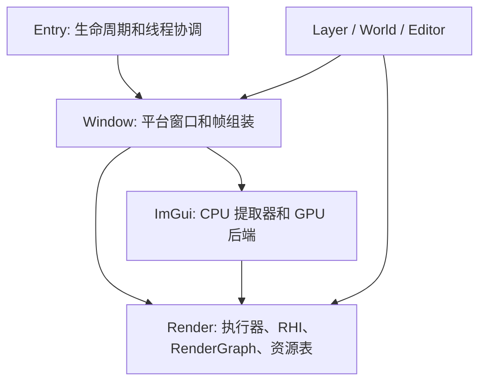

# Aether 独立渲染线程设计与 LLM 实施规范

## 1. 文档定位与基线

本文定义 Aether 从“主线程更新和录制 + SubmitThread 提交”迁移到“主线程更新 + RenderThread 渲染”的目标设计、约束及分阶段实施步骤。

- 核查日期：2026-09-21。
- 核查提交：`1da6618`；编写文档时工作区没有已有修改。
- 图形后端：Vulkan，当前默认 Vulkan 1.3，启用 dynamic rendering。
- 窗口：SDL3。
- 仓库内 Dear ImGui：`1.92.3 WIP`，已经使用动态纹理 API 和 `ImTextureRef`。
- 当前 `Window::MAX_FRAMES_IN_FLIGHT = 2`，`Render::Config::MaxFramesInFlight = 2`，固定资源数组容量 `InFlightFrameResourceSlots = 3`。
- 文档中的新类型、接口和测试是待实施设计，不表示当前已经存在。本次文档整理没有实施运行时代码变更，也没有运行 GPU 验证。

文中的“必须”是最终验收条件。“过渡阶段”只允许作为可测试的迁移中间态，不得据此宣称独立渲染已经完成。示意签名允许随现有代码布局调整，但所有权、线程归属、顺序和完成语义不得省略。

未来执行本文前，必须重新检查 HEAD、工作区和适用的 `AGENTS.md`。如果源码已经变化，先更新基线映射，再按本文不变量实施。

## 2. 复查结论：当前实现与需要修正的假设

### 2.1 当前一帧的实际调用链

```text
主线程 MainLoop::Run
  Application::OnFrameBegin / 完成后台任务
  WindowContext::PollEvents / Window::DispatchEvent
  Window::OnUpdate
    Layer::OnUpdate
    NeedRebuildRenderGraph -> CreateRenderGraph（必要时）
    ImGui NewFrame -> Layer::OnImGuiUpdate -> ImGui::Render
  Window::OnUpload -> Layer::OnUpload
  Window::OnRender
    等待当前 slot fence
    向 SubmitThread 请求 acquire，然后阻塞等结果
    Window::OnImageAcquired
      切换 InFlightResourceAllocator slot
      Layer::OnFrameBegin
      上传、RenderGraph::Execute、ImGui graph、blit
      向 SubmitThread 排入 submit / present

SubmitThread
  acquire / vkQueueSubmit / vkQueuePresentKHR / CustomSubmit
```

代码入口：[main.cpp](../Runtime/Entry/src/Entry/main.cpp)、[MainLoop.cpp](../Runtime/MainLoop/src/MainLoop/MainLoop.cpp)、[Window.cpp](../Runtime/Window/src/Window/Window.cpp)、[SubmitThread.cpp](../Runtime/Render/src/Private/Render/Threads/SubmitThread.cpp)。

### 2.2 复查确认的耦合和风险

| 位置 | 当前事实 | 对实施的影响 |
| --- | --- | --- |
| `Window` | 同时持有 SDL、Layer、输入、swapchain、graph、GPU frame 和上传队列 | 拆分平台对象与渲染对象的所有权 |
| `Window::OnUpdate`、`PushLayer/PopLayer` | 直接创建或替换 graph | 图的构建、替换和执行统一归渲染线程 |
| `WindowContext::HandleFramebufferResize` | 事件处理中立即等待并重建 GPU 对象 | 事件只发布窗口状态，渲染端统一处理重建 |
| `Window::OnRender/OnImageAcquired` | 录制过程中调用 `GetSize()`，内部使用 SDL | 使用已发布的 pixel extent 和实际 image extent |
| `Layer::OnFrameBegin` | 在 acquire 后执行，但部分 UI 实现会做布局和访问 World | 按行为拆分，不能把这个回调整体迁到渲染线程 |
| `World::Dispatch` | 修改 dispatch depth、执行顺序等共享状态 | 不是线程同步机制；World 和 ECS 保持主线程所有 |
| Sandbox task、Text Raster task | 保存 `Layer*`、`Raster*`、资源对象指针 | 仅允许指向渲染线程独占且生命周期受管理的对象 |
| ImGui RenderGraph backend | 读取 ImGui IO/PlatformIO、draw data 和纹理 map | 需要前端提取器与独立 GPU 后端 |
| `ImDrawList::CloneOutput()` | 复制 Cmd/Idx/Vtx buffer，但不复制 `_CallbacksDataBuf`，`TexRef` 可保留 `_TexData` | 不能直接作为最终跨线程快照 |
| `PendingUploadList` | 创建 staging、存目标裸指针、按帧计数回收 | 拆分拥有 CPU 数据的请求与按 fence 回收的 staging |
| RHI `Texture2D::Create` | 非 Undefined 初始布局会触发同步 transition | 创建纹理也可能提交 queue，必须审计隐藏提交 |
| `GraphicsCommandBuffer::Submit`、同步 copy | 直接调用 `vkQueueSubmit` | 当前 SubmitThread 并不是唯一 queue 调用者 |
| 编辑器 `GlobalTextureCache` | worker 内执行 `LoadTexture`，后者创建和同步上传 GPU 资源 | worker 必须改为只读取/解码 CPU 数据 |
| GRC | pool 为 thread_local，frame index 为全局普通整数 | 增加显式线程上下文和 frame context |
| Entry cleanup | 先 app shutdown，再停 SubmitThread，再等待 GPU | Layer/GPU 对象可能在仍被使用时销毁 |
| Window destructor | 有 Layer 时调用 SubmitThread::WaitIdle，然后调用 OnDetach | 若提交线程已停会等待无消费者的任务；已有应用先 delete Layer 还留下悬空指针 |

以下是相对初步方案的重要修正：

1. Vulkan 允许不同线程使用同一对象，只要满足其同步要求；本文选择渲染线程独占是引擎约束，不是所有 Vulkan 对象都存在创建线程亲和性。
2. 仓库中不存在 `ImDrawData::CloneOutput()`；存在的是 `ImDrawList::CloneOutput()`，且仅靠它仍不够。
3. `shared_ptr<GPUObject>` 不自动保证 GPU 安全：最后一个引用可能在主线程释放，也不代表 GPU 已完成。主线程句柄必须与实际 GPU 析构分离。
4. CPU 帧队列容量为 2，不等于只领先 GPU 两帧。排队、正在录制、GPU 执行是不同阶段，必须分别计量。
5. 等待 graphics fence 不能证明 present 已完成。不能以图形提交序号回收 present semaphore。
6. 丢弃旧绘制帧不能丢失其中的纹理创建、字体更新或资源销毁。可靠资源命令与可跳过的绘制负载必须分离。
7. Render 模块不能为了容纳完整 FramePacket 而反向依赖 Window、ImGui、World。

## 3. 第一版目标和范围

第一版目标：主线程进行 SDL 事件、逻辑、UI 布局和 ImGui 帧构建；一个长期存活的 RenderThread 负责所有运行期 GPU 对象操作、graph 构建/执行、命令录制、acquire/submit/present 和 GPU 资源回收。主线程帧 N+1 可以与渲染线程帧 N 的录制重叠。

第一版采用以下明确选择：

- 合并现有 SubmitThread 职责到 RenderThread，最终不再启动单独的 SubmitThread。
- 一个应用级 RenderThread；先保证现有单主窗口流程。窗口用独立 ID，避免锁死未来多窗口扩展。
- 使用 `std::mutex + std::condition_variable` 实现有界 FIFO，先不引入无锁队列。
- GPU frame slot 数仍为 2；默认 CPU 绘制负载 outstanding 上限为 2，定义见第 5 节。
- 正常运行按 FIFO 渲染，不做任意 latest-frame 覆盖。窗口暂停、旧窗口版本、acquire Timeout/NotReady 和 out-of-date 可以跳过绘制。
- RenderGraph 保留按需构建模式；每帧相机/变换等数据更新不重建场景 graph。ImGui 可以保持每帧临时 graph。
- 保留现有 Vulkan fence/binary semaphore 基础设施，不强制引入 timeline semaphore。
- 已存在的共享纹理原地更新，第一版允许先等待相关 graphics 使用完成；高性能版本化更新留待后续。
- 保留 `PushLayer(Layer*)` 的非拥有语义，明确 detach 合同；不在本次强制把所有 Layer 改成 unique_ptr 所有权。
- raw ImGui callback 必须显式迁移为引擎可拥有数据的回调协议；不默默删除回调或并发调用主线程 ImGui context。

不属于第一版：并行录制 secondary command buffer、多 GPU queue 异步计算、ImGui 多 viewport、完整 RenderGraph 重写、独立模拟线程、资源系统全量重构、自动恢复 device lost、保证系统拖拽窗口阻塞主线程时逻辑仍持续更新。渲染帧由主线程生产，因此独立线程本身不能保证主线程暂停时画面继续产生新状态。

## 4. 模块与所有权

### 4.1 依赖方向



现有 `ImGui -> Window_header` 适配依赖可以先保留，但新 CPU 快照/GPU 后端不得依赖 `Window` 实例。不得增加 `Render -> Window/ImGui/World` 的 include/link 依赖。

建议文件布局（均为待新增）：

| 模块 | 文件 | 职责 |
| --- | --- | --- |
| Render Public | `Render/Threads/RenderThread.h` | FIFO、状态、CPU 完成 ticket、错误结果 |
| Render Public | `Render/Threads/RenderCommand.h` | move-only 命令接口，无 SDL/ImGui 类型 |
| Render Public | `Render/Frame/RenderFrameContext.h` | slot、提交序号、GPU 完成状态 |
| Render Public/Private | `Render/Resource/RenderResourceHandle.h`、资源 registry 实现 | 逻辑句柄与 GPU 所有权分离 |
| Render Private | `Render/Threads/RenderThread.cpp`、`Render/Frame/FrameRetirement.cpp` | 执行循环及 GPU 回收 |
| Window | `Window/RenderWindowState.h/.cpp` | 本窗口所有渲染对象，不执行 SDL 调用 |
| Window | `Window/FramePacket.h`、`Window/WindowRenderBridge.h/.cpp` | CPU 帧快照、前端到渲染状态的桥接 |
| ImGui | `ImGui/Compat/ImGuiRenderPacket.h`、提取器实现 | 固定 draw 数据和逻辑 texture ID |
| ImGui | `ImGui/Backend/imgui_impl_rendergraph.*` | 仅接收 packet 和显式 backend/context |

`RenderThread` 只理解拥有数据的 `RenderCommand` 抽象及完成协议。上层模块实现命令类，执行时在渲染线程查询其渲染状态表。可用 `unique_ptr<IRenderCommand>` 或等效 move-only 类型擦除；不要在 Render 中定义包含 SDL resize、ImGui packet、World snapshot 的大 `std::variant`。

### 4.2 对象所有权表

| 对象 | 所有者/访问者 | 跨线程形式 |
| --- | --- | --- |
| SDL_Window、Input、事件列表、Layer 列表 | 主线程 | WindowId + 值类型窗口状态 |
| World、ECS、UI Hierarchy、ImGuiContext | 主线程 | 不可变数据副本 |
| 文件读取、图片解码结果 | worker 创建，主线程接收 | 拥有字节的 CPU blob |
| FramePacket | 主线程构建，入队后交给渲染线程 | move 所有权；入队后生产者不得访问 |
| RenderWindowState、RenderFeature | 渲染线程 | ID 和创建/更新/移除命令 |
| GPU texture/view/pipeline/buffer/descriptor | 渲染线程 registry / feature | 逻辑句柄，无裸 RHI 引用 |
| graph、arena、LRU pool、slot allocator | 渲染线程 | 不向主线程暴露可变引用 |
| 图形队列和 present 队列 | 渲染线程 | 不跨线程直接提交 |
| ImGui texture 前端记录 | 主线程 | ID、版本、拥有像素的更新命令 |
| ImGui texture 后端 binding | 渲染线程 | 显式 texture registry 查询 |
| readback 结果、错误、统计 | 渲染线程生产，主线程消费 | 拥有值的 completion |

`Window::GetRenderGraph/GetResourceArena/GetResourcePool/GetFinalTexture/GetCurrentFrameIndex` 等接口必须收敛为渲染端接口。主线程取渲染结果应使用 texture handle 或 readback 请求，不能取得可修改的 GPU 对象。

## 5. 消息、背压与帧编号合同

### 5.1 三种编号与两种完成

- `CpuFrameId`：主线程产生的单调递增帧号，仅追踪快照和延迟。
- `FrameSlot`：可复用 GPU 资源槽；渲染线程等待该槽 fence 完成后取得。不是 `CpuFrameId % 2`。
- `SubmissionSerial`：每次成功 graphics queue submit 后产生的单调递增编号，包括 upload-only 提交；一个 slot 记录自己最后一次 submit 的 serial。
- `CommandTicket` 完成：CPU 命令被执行或取消；不保证 GPU 已结束。
- `GpuCompletion` 完成：某个提交 fence 已 signal。present 完成另外处理。

需要区分调试用 `FlushCpuThrough(ticket)` 与显式 `WaitGpuIdle`。不得把两者都命名成语义模糊的 `WaitIdle()`。渲染线程不得向自己的队列入队后同步等待该命令。

### 5.2 FIFO 和可靠命令

同一个主线程是唯一生产者；后台任务的 completion 先回主线程，再转换为 render commands。

以下命令可靠、有序，不能因绘制帧被跳过而丢失：创建/更新/释放资源、Attach/DetachFeature、窗口状态更新、graph 结构更新、readback、退出清理。每条命令拥有参数；`span`、捕获引用、主线程 `this` 指针不能成为延迟执行数据。

创建命令的描述也必须拥有其内容。例如当前 `rhi::PipelineDesc` 含 `VertexShader*`/`PixelShader*`，不能原样复制到消息；前端命令保存 shader handle 或拥有的 shader 源/SPIR-V，渲染线程解析为临时 PipelineDesc 后同步创建。

`FramePacket` 仅包含可跳过的绘制状态及引用的逻辑 ID，例如：

```cpp
// 定义在 Window 或桥接层，不放进 Render 底层。
struct FramePacket {
    WindowId window;
    uint64_t cpuFrameId;
    uint64_t windowStateVersion;
    PixelExtent requestedExtent;
    std::vector<FeatureFrameSnapshot> features; // 每项拥有 CPU 数据
    ImGuiRenderPacket ui;                      // 无 ImGui context 指针
};

struct RenderFrameContext {
    uint32_t frameSlot;
    uint64_t cpuFrameId;          // upload-only 可以没有对应 CPU frame
    uint64_t completedSerial;
    // command list / allocator 等只能在当前渲染调用范围内借用
};
```

资源创建/更新命令排在首次引用它的绘制帧之前；释放排在最后一次前端引用之后。一个主线程帧可组装为 `ReliableCommands + OptionalDrawPacket` envelope 原子接受，消费时无论 draw 是否跳过都必须执行 reliable 部分。envelope 接受失败时不转移所有权、不确认 ImGui 更新；不得部分接受后假装整个帧失败。

为避免无限内存增长，队列同时限制 draw outstanding 数、命令数量和拥有的 CPU 字节数。建议初始 draw outstanding=2，命令数=256，CPU payload budget=64 MiB，均是工程初值而非 Vulkan 限制。单个超限请求明确返回 TooLarge 或拆为可重组批次，不能永久等待不可能满足的容量。错误结果通知和 stop 标志不能被满队列阻塞。

### 5.3 背压与主线程响应

draw outstanding 计算“已接受且未完成 CPU 消费/取消”的 draw packet，包含正在处理的 packet；主线程当前正在构建的一帧和 GPU slot 内已提交的资源另计。CPU 消费结束即可归还 draw credit，GPU 资源仍由 slot/retirement 保活。统计中必须分开记录这三部分。

主线程使用 `TrySubmit` 或短时等待容量，在等待间隙继续处理 SDL 事件和渲染错误，但不递归调用 Layer update/ImGui NewFrame。最好在开始新一帧前取得生产容量；若构建后才遇到背压，则保留该待提交帧，不覆盖其存储。

窗口最小化时仍处理可靠命令；upload-only 工作使用正常 graphics slot 和 fence，不能依赖成功 acquire 才推进资源队列。没有工作时使用条件变量休眠。主线程暂停绘制快照生产，并对空闲循环节流，防止 CPU 忙等或每个逻辑 tick 累积 staging。

## 6. Layer、World 和 RenderGraph 的边界

### 6.1 回调迁移合同

| 当前回调 | 最终行为 |
| --- | --- |
| `Application::OnFrameBegin` | 主线程，仅逻辑和完成结果处理；不推进 GPU slot |
| `Layer::OnAttach/OnDetach` | 主线程；SDL/UI 绑定、注册/注销渲染 feature、发送命令 |
| `Layer::OnUpdate/OnEvent/OnImGuiUpdate` | 主线程 |
| `Layer::OnFrameBegin` | 检查每个实现；布局逻辑保留在主线程，GPU 写入迁到 RenderFeature |
| `Layer::NeedRebuildRenderGraph` | 主线程检测拓扑/配置变化，发布版本化 rebuild 描述 |
| `Layer::OnBuildRenderGraph` | 改为渲染线程 `RenderFeature::BuildGraph`，不调用原 Layer |
| `Layer::OnUpload` | 前端生成拥有 CPU 数据和逻辑目标 ID 的 upload 请求 |
| `World/System` 的渲染回调 | 从主线程 World 提取数据，驱动独立 render feature；不在渲染线程再次 Dispatch World |

建议新增 `ExtractRenderData` 主线程回调；渲染对象提供 `CreateResources`、`PrepareFrame(context, snapshot)`、`BuildGraph`、`ReleaseResources`。RenderFeature 不反向保存 Layer/World 指针。

UI Hierarchy 的 `RebuildLayout()`、相机计算、节点更新属于主线程提取之前的工作。当前 `DebugUILayer::OnFrameBegin -> Hierarchy::OnFrameBegin` 含布局更新，迁移时要把它提前到快照提取前，而不是只改线程。

### 6.2 Graph 构建和每帧数据

graph、ResourceAccessor、arena、pool 全部由渲染线程访问。task 可以借用同一渲染线程稳定的 feature 对象；必须保证 graph 停止使用该 feature 后才能销毁 feature。

graph task 不得保存当前临时 `FramePacket*`；持久 graph 执行时通过本次显式 `RenderFrameContext` 或 feature 的当前 slot 数据读取快照。每次 Execute 前绑定当前帧，Execute 后解除临时借用；异步 GPU 所需对象转入 slot 保活。

第一版 graph 拓扑切换可采用保守策略：渲染线程等待相关 graphics 提交结束，再销毁旧 graph、释放 imports/feature 依赖并构建新 graph。该停顿只允许发生在拓扑变化、detach 和 resize，不应进入正常每帧路径。

RenderGraph 的 `AccessId` 只属于图，不是公共资源 handle。跨线程资源 ID 使用独立 registry；渲染线程解析后再导入 graph。图重建后重新生成 AccessId，不在旧 CPU packet 中保存它。

Sandbox 的 `CircleLayer*` task 数据改为渲染侧 pipeline/feature 引用。Text Raster 的 mesh/UBO/descriptor 更新从 `Raster::Render` 的建图阶段拆到当前 slot 的 `PrepareFrame`，不能只修改入口签名而保留共享可写 buffer。

## 7. ImGui 1.92 专项设计

### 7.1 CPU packet 内容

保持 ImGuiContext、SDL backend 的 ProcessEvent/NewFrame、控件调用、`ImGui::Render()` 全在主线程。只在 Render 后、下一次 NewFrame 前提取：

- `DisplayPos`、`DisplaySize`、`FramebufferScale`。
- 独立拥有的 vertex/index 数组。
- 每条 command 的 clip rect、ElemCount、IdxOffset、VtxOffset、固定逻辑 texture ID。
- 显式 callback opcode 和拥有的 payload。

不传递 `OwnerViewport`、`ImTextureData*`、`Textures*`、`BackendUserData`、`ImDrawListSharedData*` 或上下文指针。backend 的 texture map、pipeline、sampler、descriptor 独立保存在渲染对象中，通过参数传递，不能再从 `ImGui::GetIO()` 查找。

本地事实依据：[imgui.h](../Runtime/ImGui/src/ImGui/Core/imgui.h)、[imgui_draw.cpp](../Runtime/ImGui/src/ImGui/Core/imgui_draw.cpp)、[imgui_impl_rendergraph.cpp](../Runtime/ImGui/src/ImGui/Backend/imgui_impl_rendergraph.cpp)。优先适配仓库版本，不假定最新上游接口与它相同。

### 7.2 动态字体/纹理协议

1. 提取器在主线程处理 `WantCreate/WantUpdates/WantDestroy`。为创建分配稳定逻辑 TextureId；它不等于 VkDescriptorSet，不能回收后让旧 packet 命中新纹理。
2. 复制创建/更新所需像素；读取本版本实际字段 `UpdateRect/Updates`，保留格式、尺寸、区域、行距和内容版本。
3. 将可靠 texture 操作与 draw packet 一起提交；接受成功后，主线程才调用 `SetTexID/SetStatus`。这里确认的是桥接层已接管请求，并保证按序兑现；GPU 失败必须转为 renderer Failed，不能继续渲染未兑现 ID。
4. 构建 draw packet 时将所有 `ImTextureRef::_TexData` 解析为本次逻辑 ID。新建纹理尚未有原生 ID时使用前端临时映射；不能在渲染线程调用 `ImDrawCmd::GetTexID()` 解引用原 ImTextureData。
5. 接受成功的销毁请求可由前端确认 Destroyed 并清理前端记录；后端独立维护旧 GPU binding，直到其最后使用 fence 完成。回传消息不得持有可能已被 ImGui 释放的 ImTextureData 指针。
6. 对同一逻辑纹理多次区域更新必须保持先后次序。第一版原地更新前等待此前 graphics 使用完成，再录制 copy 和 transfer-to-sample barrier；不得只等待当前 slot 就覆盖另一 slot 仍在使用的内容。
7. 即使 resize/minimize 导致 draw 被跳过，已接受 texture 操作仍执行，可使用 upload-only submission。

用户图片的 AddTexture/RemoveTexture 改为逻辑资源注册/释放，不在主线程创建 descriptor pool，也不直接 erase GPU binding。前端 texture token 析构不能直接析构 RHI 对象；退出时由 registry 显式收尾，避免静态缓存活到 device 销毁之后。

### 7.3 回调兼容策略

第一版继续支持 ResetRenderState。自定义绘制回调使用引擎接口，例如 `RenderCallbackId + OwnedPayload`，在渲染线程收到显式 `RenderCallbackContext`（command list、pipeline 等），不能通过 `ImGui::GetPlatformIO().Renderer_RenderState` 获得状态。

遗留 `ImDrawCmd::UserCallback` 没有普遍可证明的数据所有权：即使复制了 callback bytes，bytes 内仍可有指针。提取时对未注册的 raw callback 返回明确 UnsupportedCallback，并迁移仓库内使用者；不静默忽略，也不靠把 `GImGui` 改为 thread_local 来访问同一个 context。

当前 `ImGui.Tests` callback 会修改 `TestLayer::callbacks` 并读取 PlatformIO。测试需迁为返回计数 completion / 专用 render callback context；保持“回调执行、状态重置”的覆盖，不能删除测试来绕过迁移。

## 8. GPU slot、资源回收和 RHI

### 8.1 稳定资源句柄

主线程只持有 `{index, generation}` 或不复用的单调 ID，以及 CPU 元数据。GPU registry 由渲染线程拥有实际 texture/view/pipeline/buffer。

资源生命周期必须覆盖：已接受且尚未执行的命令、正在录制的帧、持久 graph 的依赖、已提交 GPU 的使用。FIFO 中的 Release 只能表示前端不再使用；如果 graph 仍引用资源，需先移除/重建 graph 或保留依赖 pin。执行 Release 后将对象放进退休表，等最后相关提交完成才物理释放。

可复用现有 arena 的代际 ID 实现思路，但不得直接将 graph-local AccessId 作为全局句柄。不要为了此任务重构无关 CPU Cache/LocalRef；只迁移其持有 GPU wrapper 的位置。

### 8.2 替换按逻辑帧计数的回收

现有 PendingUploadList、ResourceLruPool、ImGui retired texture 都包含帧计数回收。最终回收应挂到 slot fence 或 `SubmissionSerial`：

```text
成功 submit -> slot.lastSerial = S，slot 保留 staging/临时 graph/资源 pins
该 slot 的 fence 完成 -> S 对应资源可退休
旧 graph 资源 -> 等最后使用序号完成后才进入可复用 LRU
```

LRU 的容量淘汰仅作用于已经可复用的资源，不能因 pool 超容量立即销毁仍被 GPU 引用的对象。外部 imports 不拥有纹理，销毁 import 注册不等于 texture 已可释放。按依赖顺序释放 view/descriptor/framebuffer，再释放 texture/buffer。

图形完成序号可以由按序提交的 fence 维护已完成前缀；所有 upload-only 提交也进入该追踪。不要把“收到 CPU command completion”当成前缀推进依据。

### 8.3 帧执行顺序与异常

正常帧：

1. 检查窗口状态版本、暂停和停止状态。
2. 找到可用 slot，等待/轮询其 fence；回收该槽上次提交的临时对象。
3. 前序可靠资源命令按 FIFO 执行，必要时使用独立 upload-only submission。若这些工作消耗了刚取得的 slot，重新取得可用 slot 再继续绘制；不能绕过它们的 fence。
4. 使用有限 timeout acquire image；Timeout/NotReady 时将本次 draw 完成为 Skipped，归还 credit，继续消费后续命令。保持 fence 未 reset，不推进绘制 slot；不把该 packet 永久放在队首重试，以免阻塞后面的 resize/stop。没有后续工作时进行短时等待或条件变量休眠。
5. acquire 成功后写当前 slot 的 GPU buffer，录制 upload/scene/UI/blit，结束 command buffer。
6. 在即将 submit 时才 reset slot fence；检查 reset、begin/end、submit 的返回值。
7. submit 成功才记录 serial、进入 GPU 在用状态并推进 slot；随后 present 并处理返回值。

不要在 acquire 成功后简单 `return`：imageAvailable semaphore 和 acquired image 必须有配套处理。第一版遇到这一阶段的录制异常，允许将 renderer 标为 Failed 并进入统一退出，不继续复用该 slot/image。若实现恢复，必须显式消费 acquire semaphore、处理 image 归还/交换链退休并有测试。

如果 reset 后 submit 失败，不能继续等待一个永远不会 signal 的 fence。错误路径记录该 slot 未提交并进入 Failed；不能把 fence 人工标成“GPU 完成”。GPU/驱动调用本身可能阻塞，有限 acquire timeout 和 stop token 不能被描述成可强制打断任意驱动调用。

### 8.4 frame context 与隐式提交审计

移除主线程推进 GRC frame index 的逻辑。优先显式传 `RenderFrameContext` / `frameSlot`；`DescriptorSet::CreateForFrame` 可作为迁移入口。`InFlightResourceAllocator` 继续按槽提供资源，但槽选择只能由渲染端在 fence 后执行。

统一 slot 配置来源并验证 `1 <= frameSlotCount <= InFlightFrameResourceSlots`，不要让 Window 常量、Config 可变值和数组容量独立控制循环。

必须审计这些已有路径：

- `rhi::Texture2D::Create -> SyncTransitionLayout`。
- `Render::Utils::SyncUploadTexture2D -> Texture2D::SyncCopyBuffer`。
- `vk::Buffer` 的同步 copy。
- `GraphicsCommandBuffer::BeginSubmit/Submit`。
- ImGui GPU readback 测试中的直接 submit。
- `GlobalTextureCache/Utils::LoadTexture`、Text Font、UI texture loader。

第一版可以暂时保留渲染线程内部的同步 helper，但必须所有 queue 调用归同一线程，且不能向自身队列提交后等待。随后可将初始化 transition/upload 合入 frame 命令减少停顿。不要未经 graph layout 审计就删除 `Texture2D::Create` 的同步 transition，否则导入/创建资源声明的初始布局会与真实图像不一致。

### 8.5 pool 与 device 生命周期

推荐创建显式 `RenderDeviceThreadContext` 拥有 command pool 和 descriptor pools；已有 thread_local GRC 可暂时封装，但必须有显式释放入口。

command buffer 持有创建它的 pool 指针，需先释放所有 command buffer，再释放 pool。跨线程 handoff 前主线程不得留下仍会使用同一 pool 的对象。GPU pools、allocator 和所有 RHI wrapper 必须在 device 销毁之前释放；不能依赖进程退出时 TLS/static 析构。现有 `once_flag` 在 reset 后不可重置，需要显式禁止重复初始化或改成可重建的上下文所有权，不能清空 unique_ptr 后继续 call_once。

## 9. 窗口状态、resize 和 presentation

### 9.1 窗口状态版本

主线程维护 `WindowState {pixelExtent, minimized, version}`。一次 PollEvents 批次中的连续 resize/minimize/restore 合并为最后状态，再发送可靠命令。不要越过已接受的资源操作/帧随意合并 FIFO 中的命令。

渲染线程维护 requested state 和独立 swapchain generation。`windowStateVersion` 表示主线程发布版本，swapchain generation 表示 GPU 交换链实例；内部 out-of-date 重建可以改变后者而不改变前者。

处理新状态后，旧版本 draw 可跳过；在该状态命令之前已排队的旧帧允许先完成。不要声称 FIFO 后部 resize 可以立即抢占前面的 Vulkan 调用。像素尺寸为零或 minimized 时不 acquire，但仍运行可靠资源命令。

out-of-date 时渲染线程请求主线程重新采样尺寸（值类型 completion），并避免同一旧 extent 的无限重建循环。主线程容量等待期间也必须消费这类 completion。渲染线程不等待一个只能靠主线程恢复事件循环才能执行的同步 SDL 回调。

### 9.2 重建顺序

第一版允许 resize 使用较重的等待，保持正常帧不 device-idle：

1. 渲染线程停止向旧 swapchain acquire/submit。
2. 等待旧 graphics 提交完成，处理 presentation 退休（见下文）。
3. 释放旧 ImGui frame graph、场景 graph/import view、framebuffer、final view/image、swapchain view 和对应同步对象。
4. 按 capability 选择实际 swapchain extent/imageCount；区分请求尺寸和实际尺寸。
5. 创建新资源及同步对象，重建图，再接受匹配窗口状态的绘制。

blit 源范围取 final texture 实际尺寸，目标取 swapchain 实际 extent，不能重新查询 SDL，也不能盲信 packet 中的请求尺寸。

### 9.3 present semaphore 的特别规则

保持已有设计：imageAvailable/fence/command buffer 按 frame slot；renderFinished semaphore 按 swapchain image index。再次 acquire 同一 image 后，新的 graphics submission 等待其 acquire semaphore，再复用该 image 的 renderFinished。

graphics fence 完成只证明图形工作已完成。第一版若沿用未扩展 Vulkan 的 `vkDeviceWaitIdle` 退出/重建 fallback，必须明确这是通行兼容做法，不是 presentation 退休的完整规范证明。优先在支持时探测并启用 `VK_EXT_swapchain_maintenance1` 或对应 KHR 变体，用 present fence 追踪；不支持时记录 fallback 能力。不得因线程改造强制提高所有平台的扩展要求。实现阶段按本地 SDK 和目标设备核实扩展及 feature chain。

上述区别见 [Khronos Swapchain Semaphore Reuse](https://docs.vulkan.org/guide/latest/swapchain_semaphore_reuse.html)，包括其关于无扩展 shutdown 的限制。present 返回 `SUBOPTIMAL/OUT_OF_DATE` 必须进入重建路径；其他失败报告并退出，不能像当前实现一样忽略。

## 10. 启动、停止与错误状态机

### 10.1 启动

第一版采用可验证的 bootstrap handoff：

1. 主线程创建 SDL/video、Window，获取实例扩展。
2. 主线程完成现有 Vulkan instance/surface/physical device/device/allocator bootstrap；此时尚无并行渲染。surface 的 SDL 创建保留主线程。
3. 启动 RenderThread，发布不可变 device 信息，创建渲染线程 pools 和 RenderWindowState。
4. 主线程创建 ImGuiContext/SDL backend；GPU backend 创建通过命令进行。等待 Ready 完成结果后才允许应用开始提交 draw。
5. 主线程 `Application::OnInit` / Layer attach 只做前端初始化和资源命令，首帧按序依赖这些命令。

这避免引入“渲染线程创建 instance 后，同步回调正在等待它的主线程去创建 surface”的等待环。可在后续拆分 device bootstrap，但本轮不必强行移动所有启动调用。

### 10.2 状态与完成结果

执行器状态至少包含 `Starting -> Running -> Stopping -> Stopped`，任何阶段可进入 `Failed`。启动失败、运行时异常、submit 错误和退出必须统一唤醒等待容量、初始化 ticket 和 command completion 的调用方。每个已接受命令必须最终得到成功、跳过、取消或错误结果，不能永远悬挂。

worker 顶层捕获异常，保留原错误信息并回传主线程；析构函数不抛异常。停止后新提交返回 Stopped，重复 stop/join 安全，未启动对象可安全释放。worker 不得持有队列 mutex 执行 GPU 工作或用户 render callback。

### 10.3 正常退出顺序

1. 主线程停止产生新 draw，但渲染线程仍活着、资源命令仍可受理。
2. 停止资源请求生产者，等待后台 CPU jobs 结束；在其捕获的 Layer/cache 仍有效时处理或显式取消 completion。现有 `GlobalThreadPool::Destory()` 会 join 后直接删除 pool 和完成队列，不能先调用它再 GetCompleteQueue。实施时增加 StopAccepting/JoinWorkers/DrainOrCancelCompletions/Destroy 的分阶段能力，或等效的 ShutdownAndDrain 回调；不能在 device 销毁后还有 worker 加载 GPU texture。
3. 显式等待已有渲染工作/必要 readback 完成，再调用主线程 `Application::OnShutdown`；这个钩子可取消请求、PopLayer、释放前端 handles。
4. `PopLayer` 先从主线程列表移除并恰好调用一次 OnDetach，再按序发送 DetachFeature。调用方之后才能 delete Layer。Window 析构时列表必须已清空或仅包含仍有效对象，不能保存被应用删除的指针。
5. ImGui 前端提交最终 texture release，清空前端缓存/记录；等待其可靠命令接受。此时所有 GPU 对象仍由后端 registry 持有。
6. 关闭生产端，发送最终停止请求。执行器排空可靠命令；剩余 draw 可取消并归还 credit。等待已经提交的 GPU 工作，处理 swapchain retirement。
7. 渲染线程先释放 graph 对 feature/资源的引用，再释放 feature、ImGui GPU backend、window GPU 资源和 registry，最后释放自身 command/descriptor pools，然后退出；主线程 join。
8. 主线程销毁 ImGui CPU context/SDL backend，销毁 surface 和 SDL window；确认所有 GPU wrapper 已消失，再释放 allocator、device、instance 和 SDL。

`Window` 的普通析构不得向已停止的线程发送 WaitIdle。正常 cleanup 调用显式 `ShutdownRendering`，析构只做幂等的残余释放/断言。保留非拥有 Layer API 意味着必须同步修改 Sandbox、Editor 和测试的 OnShutdown；不能只修 Window 内部然后假设外部遵守新合同。

Failed 路径可以取消未执行资源创建，但必须完成其 ticket；统一清理已创建资源。device lost 不继续正常帧流程。启动中每一个成功创建阶段都应有可反向执行的清理动作。

## 11. 给 LLM 的执行规则

1. 先读全文，再执行一个阶段；不得把示例类型直接当成已经存在的 API。
2. 每阶段开始记录前置条件、涉及源文件、调用者和可运行目标；结束记录代码变化、验证命令、结果及剩余约束。
3. 保持默认目标可构建。过渡阶段允许阻塞运行，但必须标注，不能提前打开异步并行。
4. 修改 `Engine/Runtime` 源码及相关上层调用者；不要手改 `Engine/Packages`、Build 产物或 vendored ImGui 核心代码。
5. 新增 `.cpp/.h` 后重新运行 CMake：当前模块使用 GLOB_RECURSE，不能假定现有 build 自动发现新文件。
6. 有关线程的测试必须断言行为/顺序/所有权；不要只扫描函数名或测试一个实现同构的 bool。测试 Release 构建也必须有效，不能只靠被 NDEBUG 删除的 assert。
7. 不把 World、Layer、ImGui context 的访问放进全局大锁来完成最终设计；这只能形成串行中间态。
8. 不用 detached thread、每帧新建 thread、无限 acquire timeout、任意 `[&]` command 或堆上的信号量裸指针拼接生命周期。
9. 不改变 shader、画面、输入行为以规避测试。若必须调整 callback/API 合同，显式迁移调用者并说明行为变化。
10. 未运行 GPU/平台测试时如实记录未验证，不能把 CPU/mock 通过写成线程化渲染通过。

## 12. 分阶段实施任务

### P0：建立可重复基线和调用者清单

前置：文档已读；工作区状态已检查。

操作：

1. 阅读 Entry/MainLoop、Window/WindowContext/Layer、SubmitThread、GRC、InFlight、ImGui backend、PendingUploadList、ResourceAccessor/ResourceLruPool。
2. 搜索所有 GPU create/destroy、同步 upload/submit、Layer/World 渲染回调、GetFinalTexture、ImGui texture API 的调用者，分类为 main/worker/render/bootstrap。
3. 阅读 Editor `GlobalTextureCache`、UI texture loader、Text Font/Raster 和测试；不能只验证 Sandbox。
4. 构建当前默认目标并记录现有失败。读取各测试 CMake，分清源码存在与 Build 缓存残留。
5. 记录当前正常帧、resize、minimize、退出行为；若已知退出缺陷阻止基线，记录并在 P1 修复。

已知基线限制：`RenderGraphArena.Tests/CMakeLists.txt` 引用了当前受版本控制文件列表中不存在的 `../Render.Tests/Unit/src/ResourceArenaTests.cpp`；不能直接开启该选项并声称已有测试可用。`RenderInFlight.Tests` 与 `WorldExecutionOrderTests` 当前没有 `add_test`，`ctest` 空运行不代表它们通过。`Demo` 中有旧 API 用法，默认构建关闭；先记录基线，不顺带恢复全部旧 demo。

验收：一份实际调用路径和 build/test 结果清单；不更改渲染行为。阶段完成后下一阶段必须基于该清单。

### P1：先修生命周期和主循环退出

涉及：Entry main、Application、MainLoop、Window、SubmitThread、Editor/Sandbox OnShutdown、Async cleanup、相关测试。

操作：

1. 修复现有退出：渲染消费者仍活着时等待工作完成；PopLayer 后再 delete；不在消费者停止后调用 WaitIdle。
2. 定义并落实 OnDetach 恰好一次、Window 不拥有 Layer、所有 Layer 先注销的合同。
3. 为 SubmitThread 过渡实现增加未启动/已停止/自身等待处理，防止无消费者等待；未来在 P7 移除该执行器。
4. 初始化 `MainLoop::lastTime` 再进循环，使用单调时钟；发现 Quit 后不要继续生产额外一帧。Entry 的同名局部 lastTime 不会初始化 MainLoop 静态变量。
5. 对后台任务停止和 completion 捕获对象做有序清理，采用第 10 节的 join/drain/destroy 顺序；至少保证 device 销毁前没有后台 GPU 工作，也不在 pool 删除后访问其完成队列。

验收：正常关闭、初始化部分失败、仍有工作时关闭均不会悬挂；Layer detach 次数正确；现有单线程渲染模式保持画面。此阶段不启用 render/update 并行。

### P2：提取渲染窗口状态，仍同步执行

涉及：Window.h/.cpp、WindowContext、新增 RenderWindowState/bridge、ImGuiApi 的初始化边界、InFlight。

操作：

1. 将 swapchain、final image、fence/semaphore/command buffer、graph/arena/pool、slot allocator 和 ImGui GPU frames 移入 RenderWindowState。
2. 创建/重建资源显式接收 extent/surface；移除所有渲染代码中的 SDL 查询。
3. 保留 main 侧 Window/Input/Event/Layer，建立 WindowId/WindowState 及单调版本。
4. 暂时由主线程同步驱动 RenderWindowState，保证迁移可编译；旧 API 通过桥接临时转发并标明待移除。
5. 拆开 ImGui CPU context/SDL 初始化与 GPU backend 创建，避免 RenderWindowState 析构触碰主线程 ImGui context。

验收：同等单线程行为；resize/minimize 路径使用明确尺寸；RenderWindowState 内无 SDL 调用、无遍历主线程 Layer/World 的隐式行为。阶段中尚未迁完的回调由主线程显式调用，不能隐藏到渲染对象内。

### P3：建立 RenderThread、FIFO 和完成协议，先做 CPU 测试

涉及：Render/Threads 新文件、Frame context、线程归属检查、Tests 新 `RenderThread.Tests` 目标及 CMake。

操作：

1. 实现 move-only command、原子 envelope 接受、队列数量/字节/draw credit 预算。
2. 实现 Starting/Running/Stopping/Stopped/Failed、Ready ticket、错误回传、CPU ticket 与 GPU ticket 的区分。
3. 实现 stop 满队列仍可发出、等待者被错误/停止唤醒、重复 stop/join、worker 不锁队列执行。
4. 提供 CPU fake executor，不需要 SDL 或 VkDevice 即可测试排队行为。
5. 添加 main/render 线程断言基础；本阶段不把真实旧 OnRender 放进 worker。

验收测试：FIFO、move 后所有权、运行中 packet 计入 credit、超限请求不死等、可靠命令不被 draw cancellation 删除、command exception 回传、self-wait 拒绝、满队列退出、启动失败、重复停止、ticket 恰好完成一次。

### P4：构建资源句柄、上传和 fence 回收

涉及：Render resource registry、PendingUploadList、InFlight、ResourceAccessor/ResourceLruPool、GRC/pools、RHI helpers、Editor texture cache、Text/UI loaders。

操作：

1. 实现稳定逻辑句柄和渲染侧 GPU registry；旧句柄不得命中新资源，Release 只退休，不直接跨线程析构。
2. 将 UploadBatch 变为 CPU blob + ID + 区域；渲染侧创建 staging，submit 成功绑定 serial，fence 后释放。
3. 给每个 slot 建立 submission/retained objects，接入 graph/LRU/ImGui 所需的统一回收接口。
4. 将 worker LoadTexture 拆成读取/解码，在主线程 completion 中发资源请求；前端缓存存 handle 和元数据。CPU staging 不保存 worker 栈/span。
5. 将图形资源每帧访问改成显式 context；合并 slot 配置来源，移除依赖主线程 tick 的 GRC index 路径。
6. 实现渲染线程 pools 的显式 cleanup；同步 helper 暂可保留，但列出所有直接 queue 调用并在 P7 handoff 时限制线程。
7. 对共享纹理更新落实第 7/8 节的顺序和等待，不用 MaxFramesInFlight 个 CPU tick 替代完成。

验收：上传源函数返回后仍有效；Release 前排队引用可执行；fence 未完成时 staging/GPU对象/LRU条目不会回收；最小化 upload-only 能完成且内存有界；错误的代际 ID 被拒绝。通过 CPU fake fence 测试并准备实际 GPU 场景。

### P5：拆分 ImGui 前端与后端

涉及：ImGuiApi、imgui_impl_rendergraph、ImGuiRenderPacket/提取器、Editor Image/GuiImageCache、ImGui.Tests。

操作：

1. 后端函数改收显式 backend + packet，不再调用 GetIO/GetPlatformIO/GetDrawData。
2. 主线程提取 vertices/indices/commands/display 参数；将 TexRef 解析为逻辑 ID，拒绝任何残留 `_TexData`。
3. 实现 texture 操作的可靠 envelope 和“接受后主线程确认”协议；入队失败不改变原 ImGui texture 状态。
4. 接入动态 atlas create、区域 update、destroy；移除 framesLeft 回收。
5. 实现 ResetRenderState 和拥有 payload 的回调协议；迁移既有测试，未注册 raw callback 明确报错。
6. 更新用户图片 API，使其接收稳定资源 handle，创建/删除 descriptor 完全在后端。

验收：提取后立刻开始下一次 NewFrame、修改/释放原 draw lists/atlas 数据，packet 仍正确；无跨线程 ImGui context 访问；新 atlas 首次 TexID 无效时也可正确快照；连续 atlas 更新/销毁和被跳过绘制帧不丢更新；callback/clip/VtxOffset 保持覆盖。暂继续同步调用新后端以对比像素。

### P6：拆分 Layer/World render feature 与持久 graph

涉及：Layer、World/System、Sandbox、UI Debug/Hierarchy/Render、Text Raster、相关测试和示例。

操作：

1. 定义主线程 ExtractRenderData 和渲染线程 RenderFeature 生命周期。
2. 将布局/相机/World 读取放在提取前，复制所需数据；不得从 worker 调用 World::Dispatch。
3. 迁移 Sandbox pipeline/task 指针到 CircleRenderFeature；确认帧数据不保存 Layer*。
4. 迁移 Text Raster 的准备阶段、per-slot mesh/UBO/descriptor，审计 UI 渲染调用者。
5. 让 graph 只从渲染侧 feature/描述构建，当前 frame 数据通过 context 注入；rebuild 描述与帧有序。
6. 实现 detach/rebuild 的 GPU drain/退休路径；旧 graph 不再引用 feature 后才销毁 feature。

验收：主线程删除已 Pop 的 Layer 后，已接受帧仍可完成；渲染线程仅访问自己的 feature；改变相机/颜色只更新数据不每帧 rebuild；拓扑变化能切图；World 原有执行顺序测试保留。标记只因旧 demo 基线而未迁移的不可构建路径，不把它们声称为已支持。

### P7：切换真实 Vulkan 工作到单一 RenderThread

前置：P3、P4、P5、P6 均完成；真实 packet 已经不借用主线程状态。

涉及：Entry main、RenderWindowState、RenderThread、GRC、SubmitThread 调用者、GPU tests。

操作：

1. 按第 10 节 bootstrap/handoff：在渲染线程创建运行期 pools、window GPU 资源和 features。
2. 把 acquire/submit/present 变成渲染线程直接调用；停止启动 SubmitThread，并迁移/删除其剩余消费者。
3. 全部底层 queue create/submit/wait 和运行期 GPU mutation 添加 render-thread 断言；bootstrap 为显式受控例外。
4. 首轮启用 `SubmitAndWaitCpu` 调试策略：提交帧后主线程等待 CPU 完成，验证线程归属；此时明确仍无 CPU 帧重叠收益。
5. 接入 acquire 有限 timeout、submit/present 错误、reset-fence 失败与未提交 slot 状态。
6. 将 GPU readback 改成命令，结果回传主线程，测试不直接跨线程提交。

验收：真实 Vulkan 所有运行期录制/queue 操作来自同一 worker；图像/readback 与同步模式一致；无 SubmitThread 自等待；线程初始化/退出及池析构顺序正确；Vulkan validation 未产生新增错误。

### P8：开放主线程与渲染线程重叠，接入窗口状态机

涉及：Entry/MainLoop、WindowContext、bridge、RenderWindowState、队列节流、诊断统计。

操作：

1. 替换每帧 SubmitAndWaitCpu 为有界异步提交，默认 outstanding=2；保留串行调试开关供像素/时序对比。
2. 容量等待间隙处理 SDL/completion；禁止递归完整 update；renderer Failed 时及时退出。
3. 将 resize/minimize/restore 全部转为可靠窗口状态命令，合并同次 event pump 的连续变化。
4. 处理 windowStateVersion 与 swapchain generation，旧 draw 跳过仍兑现资源操作；out-of-date 请求主线程采样。
5. 接入 present 结果；实现明确的 presentation retirement capability/fallback，并保持每 image semaphore。
6. 无 draw 时继续 upload-only、readback 和 stop；空队列/最小化节流。
7. 完成第 10 节异步退出，覆盖满队列、等待 fence、acquire timeout、resize 中关闭窗口。

验收：用同步闸门而不是 sleep 偶然性证明“主线程可生成 N+1，而 worker 被阻塞在 N”；队列数和字节不超预算；慢 GPU/慢录制不无限增长延迟；连续 resize/minimize/restore/关闭不挂起；旧尺寸图像不越界 blit；GPU 回收不受 CPU 丢帧影响。

### P9：集成验证、公开接口清理与交付

涉及：所有迁移调用者、CMake exports、Tests、本文与必要的迁移说明。

操作：

1. 删除临时 Window GPU getter 转发、无消费者的 SubmitThread 入口、全局 frame tick；搜索确认没有遗留运行期 bypass。
2. 接入 focused CPU tests 的 `enable_testing/add_test`；实际修复或替换缺源码的 Arena 测试入口，不能伪造通过。
3. 扩展 GPU 集成测试矩阵，迁移其 readback 和 callbacks，并为最小化测试按完成结果等待，避免仅按主线程 tick 计数。
4. 验证默认 Editor/Sandbox 及 HelloWorld consumer 接口；必要时对已配置安装目录执行正常 cmake install 验证 exports，不手改 Packages。
5. CPU 队列/快照/回收 tests 在独立 ThreadSanitizer 构建运行；不要把第三方 Vulkan/SDL 无法完整插桩描述成全部无数据竞争的证明。
6. 记录主线程 update/提取耗时、worker prepare/record 耗时、队列等待、GPU slot 等待和 packet 内存峰值；以实际 CPU 重叠作为完成依据，不承诺 GPU-bound 场景 FPS 必然提高。
7. 更新本文状态，列出已完成阶段、未运行平台、已知兼容 fallback 和 API 迁移点。

验收：第 13 节矩阵有逐项结果，最终设计中不变量全部满足；未验证项明确写出。性能结果必须区分 CPU throughput、输入延迟和 GPU 时间。

## 13. 验证矩阵和执行命令

| 类别 | 必测行为 | 证明方式 |
| --- | --- | --- |
| 队列 | FIFO、背压、超大请求、stop、异常唤醒 | 无 GPU 单元测试，使用 latch/semaphore 控制时序 |
| CPU 快照 | 原数组/Layer 改动或销毁后 snapshot 正确 | 拥有数据测试；必要时 ASan/TSan |
| ImGui | atlas create/update/destroy、TexRef、callback、clip、VtxOffset | CPU packet 测试 + 现有像素回读场景 |
| GPU slot | 多帧不同颜色/矩阵无串帧，失败不遗留永远无信号 fence | 受控慢 worker/实际 fence 和错误注入 |
| 回收 | queued/recording/GPU/graph 引用期间不释放 | fake completion + GPU 延迟使用场景 |
| 上传 | worker CPU 解码、纹理连续 patch、upload-only、源数据及时释放 | 读回像素、内存计数、线程断言 |
| resize | 高频变尺寸、0 extent、minimize/restore、out-of-date/suboptimal | SDL 操作 + 状态机注入 + validation |
| 退出 | 普通关闭、队列满、资源加载中、启动失败、renderer failure | 超时保护的集成测试，不允许永久等待 |
| 线程归属 | SDL/ImGui frontend 为 main，GPU mutation 为 render | 线程 ID 断言和 trace |
| 性能 | update 与 record 重叠、内存和排队延迟有界 | 时间线和计数；不以单一 FPS 判断 |

以下命令从仓库根目录执行。先读取本机 `Engine/CMake/Local.cmake` 和 cache，不覆盖已有依赖配置；新增 focused test target 后按实际名字调整。

```bash
git status --short
git rev-parse --short HEAD
rg --files Engine/Tests
rg -n 'AETHER_BUILD|CMAKE_BUILD_TYPE' Engine/Build/CMakeCache.txt
cmake --build Engine/Build --target help
cmake --build Engine/Build --target Sandbox AetherEditor RenderInFlight.Tests WorldExecutionOrderTests
./Engine/Build/Tests/RenderInFlight.Tests/RenderInFlight.Tests
./Engine/Build/Tests/WorldExecutionOrder.Tests/WorldExecutionOrderTests
```

GPU tests 默认没有启用。实施时可单独配置 build 目录（下面路径是建议的新目录；若已有内容先检查）：

```bash
cmake -S Engine -B Engine/BuildRenderThread -DCMAKE_BUILD_TYPE=Debug -DAETHER_BUILD_DEMO=OFF -DAETHER_BUILD_TESTS=ON -DAETHER_BUILD_IMGUI_TESTS=ON
cmake --build Engine/BuildRenderThread --target ImGui.RenderGraph.Tests
./Engine/BuildRenderThread/Tests/ImGui.Tests/ImGui.RenderGraph.Tests
```

需要可用的显示服务器、Vulkan device 和 validation layer。Windows/macOS 可执行文件路径和运行环境按生成器调整。Arena 选项仅在 P9 确认/修复缺失测试源文件后开启。新 tests 完成 CTest 注册后才使用 `ctest --test-dir ... --output-on-failure`；先确认发现的测试数量。

审计搜索（匹配结果需要人工判断 bootstrap/测试/注释，不能要求文本零匹配）：

```bash
rg -n 'SubmitThread|vkQueueSubmit|vkQueuePresentKHR|vkDeviceWaitIdle|BeginSubmit' Engine/Runtime Engine/AetherEditor Engine/Sandbox Engine/Tests
rg -n 'GetDrawData|GetPlatformIO|GetIO|_TexData|UserCallbackData' Engine/Runtime/ImGui/src/ImGui/Backend Engine/Runtime/ImGui/src/ImGui/Compat
rg -n 'GetFrameIndex|SetFrameIndex|GetFinalTexture|GetRenderGraph|GetResourceArena' Engine/Runtime Engine/AetherEditor Engine/Sandbox Engine/Tests
rg -n 'SyncUpload|SyncTransition|SyncCopyBuffer|LoadTexture' Engine/Runtime Engine/AetherEditor
```

## 14. 常见错误与禁止捷径

- 将 `Window::OnRender()` 原封不动丢进线程：保留了 SDL 查询、Layer 访问和 ImGui global 借用。
- 只把全局 frame index 改 atomic：无法修复逻辑帧与 GPU slot 的语义差异。
- 只给图/World/纹理 map 加锁：未解决跨帧数据一致性、GPU 使用期限和线程亲和性。
- 认为线程局部 pool 会自动迁移 command buffer：command buffer 仍关联原 pool，必须明确创建和销毁次序。
- 绘制帧中夹带唯一一份字体更新后直接丢帧：后续 packet 将引用从未创建/更新的纹理。
- 原地更新共享纹理时只等当前 slot：其他 slot 可能还在采样。
- 把主线程 `Ref<rhi::Texture2D>` 当作安全句柄：refcount 只管理 CPU 生命周期，最后析构线程也不受控。
- 用 graphics fence 销毁 present semaphore，或把 semaphore 改回每 slot：丢失 presentation 同步保证。

## 15. 实施状态（2026-09-22，工作树）

本节记录相对核查提交 `1da6618` 的实际实施结果；未列为完成的阶段不得据此宣称独立渲染线程已经启用。

| 阶段 | 状态 | 已实施内容 |
| --- | --- | --- |
| P0 | 完成 | 复核 HEAD/工作树、默认构建目标、调用路径和测试注册状态；基线提交为 `1da6618`。 |
| P1 | 完成（CPU/生命周期） | 主循环改用 `steady_clock` 并在 Quit 后停止本帧；Layer 由应用先 Pop 再 delete；后台任务按停止接收、join、drain、destroy 分段退出；Entry 使用可重复调用的反向清理；过渡 SubmitThread 对未启动、停止、重复停止及自身 WaitIdle 做保护。 |
| P2 | 完成（同类字段仍物理位于 Window） | 新增带版本的 `WindowId/WindowState/PixelExtent`；主线程发布状态，renderer 使用独立值快照；录制、交换链和 blit 不查询 SDL。GPU 字段尚未拆成单独类，但只由 RenderThread 入口访问。 |
| P3 | 完成 | 新增长期存活的 `RenderThread`、move-only command、原子 envelope、有界 draw/command/byte 背压、CPU ticket、状态机、异常/停止唤醒和 self-wait 拒绝；确定性测试已注册 CTest。 |
| P4 | 进行中 | 新增代际 `RenderResourceHandle/Registry`、按 `SubmissionSerial` 的延迟析构和 `FrameRetirement`；`PendingUploadList` staging 改为在对应 slot fence 完成后释放；统一 frame-slot 配置并验证固定容量。上传目标仍是过渡期裸指针，LRU、编辑器纹理加载尚未全部迁移。 |
| P5 | 完成（默认 Sandbox 范围） | RenderGraph GPU backend 接收显式 backend + 拥有型 packet；动态纹理操作作为可靠命令，更新采用后端 replacement 并按 slot fence 退休；渲染路径不读取 ImGui context。旧的外部 user-texture 兼容 API 尚未迁为资源 handle。 |
| P6 | 完成（默认 Sandbox 范围） | Layer/World 新增主线程提取接口和 renderer-owned `RenderFeature`；Sandbox circle 的 pipeline/task 已迁移，frame snapshot 不保存 Layer/World 指针；graph 只从 feature 构建并保活 feature。按用户范围，UI、AetherEditor、Demo 及其专用 Text 模块默认不进入 CMake。 |
| P7 | 已实施，待本批 GPU 复验 | Entry 不再启动 SubmitThread；window GPU 资源、feature、graph、acquire/record/submit/present/销毁均交给 RenderThread；GRC runtime owner guard 拒绝其他线程 GPU 访问；有限 acquire timeout、失败回传、worker stop 清理和 reset-fence 顺序已接入。 |
| P8 | 已实施，待 resize/minimize GPU 压测 | 默认最多两个异步 draw outstanding；`serialRenderThread`（或环境变量 `AETHER_RENDER_THREAD_SERIAL=1`）保留串行比较；窗口状态作为可靠值命令并用原子最新版本跳过旧 draw；最小化仍执行 upload-only submit；present semaphore 按 swapchain image，out-of-date/suboptimal 在 renderer 重建。 |
| P9 | 部分 | 七个 focused CTest 已注册并通过 Debug/Release；默认全目标（排除 UI/Editor/Demo/Text）可构建。GPU/SDL 复验、TSan、安装导出、性能数据及旧 ImGui GPU readback/user-texture 测试迁移尚未完成。 |

本批验证命令：

```bash
cmake -S Engine -B Engine/Build -DAETHER_BUILD_UI=OFF -DAETHER_BUILD_EDITOR=OFF -DAETHER_BUILD_DEMO=OFF -DAETHER_BUILD_TESTS=ON
cmake --build Engine/Build -j2
ctest --test-dir Engine/Build --output-on-failure
```

当前 Debug 与 `/tmp/aether-renderthread-release` Release 均发现并通过七个 focused CTest。真实 Vulkan Sandbox 需要在可用显示服务器上复验本批异步 handoff；此前用户验证的是切换 P7/P8 前的暂存批次，不能替代本批验证。

明确未覆盖：旧 UI/AetherEditor/Demo/Text、旧 ImGui 外部 user texture 与主线程 readback GPU 测试、TSan、安装导出和性能测量。`SubmitThread` 源码暂留作被排除模块的兼容实现，但 Entry/Window/Sandbox 已无调用者。

## 15. 参考与后续执行记录

本设计的源码依据已在相关章节链接。官方限制核查日期同文档基线：

- SDL 事件处理的线程要求：[SDL_PollEvent](https://wiki.libsdl.org/SDL3/SDL_PollEvent)。
- 像素尺寸查询也属于主线程 API：[SDL_GetWindowSizeInPixels](https://wiki.libsdl.org/SDL3/SDL_GetWindowSizeInPixels)。
- Vulkan command/descriptor pool 外部同步背景：[Khronos Threading](https://docs.vulkan.org/guide/latest/threading.html)。
- present semaphore 复用及 shutdown 的扩展/fallback 区别：[Khronos Swapchain Semaphore Reuse](https://docs.vulkan.org/guide/latest/swapchain_semaphore_reuse.html)。

实施 LLM 每阶段填写以下记录；文档建立时 P0～P9 均未实施：

```text
阶段：Px
基线提交与已有用户改动：
实际修改文件：
已落实的接口/所有权/线程合同：
执行的构建与测试命令：
结果（通过 / 失败 / 未运行及原因）：
过渡限制、平台限制：
下一阶段与前置条件：
```

推荐交给实施 LLM 的任务开头：

> 阅读 `Engine/Documents/RenderThread.md` 全文并复查当前源码。按 P0～P9 的依赖顺序实施，保留用户已有改动。每阶段完成相应构建和验收后继续；不得把过渡串行状态视为最终完成。遵守文档中的线程归属、可靠命令、ImGui 1.92 快照和 GPU 生命周期合同。记录实际验证结果与未验证平台，不增加多线程录制、多 viewport 或独立模拟线程等范围外功能。
