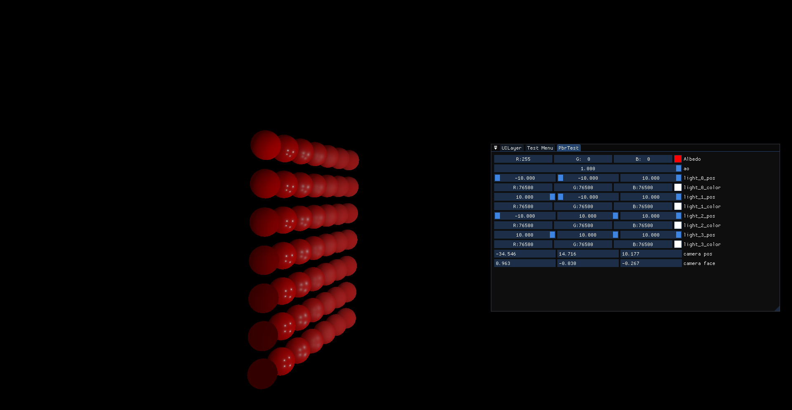
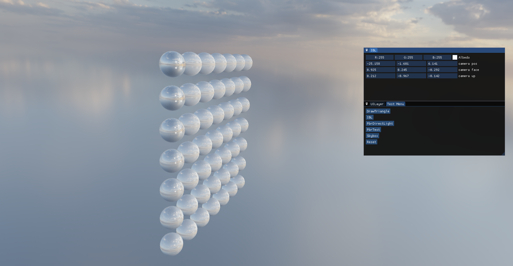
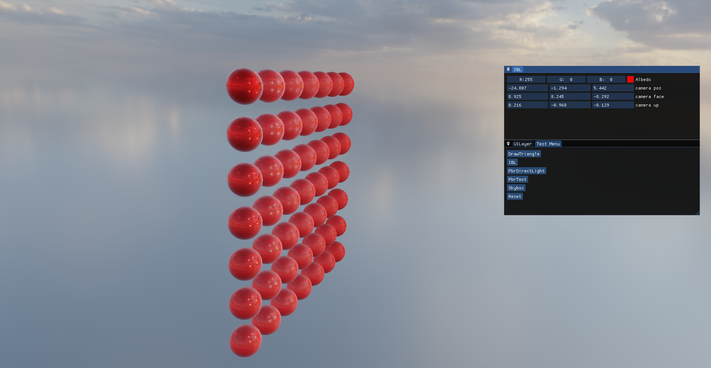
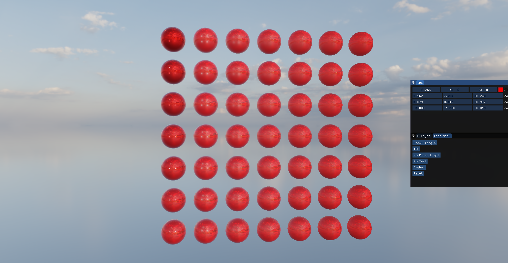

## directory structure

- Aether runtime code
- AetherEditor editor code
- Asset some resource for test
- Dependencies third party
- Sandbox test
- Test unit test
- tools tools program
- Vendor header-only third party

## screenshot

pbr direct light

IBL

